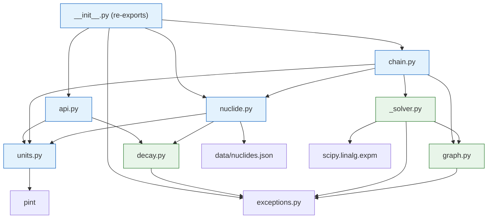
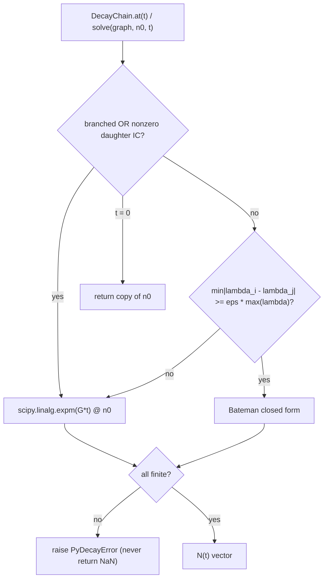
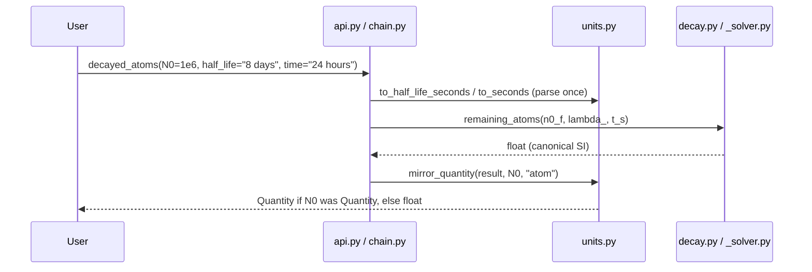

# Architecture

Three views of the package: module layering, solver dispatch, and a request
data-flow trace.

## Module layering

Boundary rules: pure-SI modules (`decay.py`, `graph.py`, `_solver.py`) never
import pint; edge modules (`units.py`, `nuclide.py`, `chain.py`, `api.py`,
`__init__.py`) may use pint on their public surface and always pass canonical
floats downward.

## Solver dispatch

(Every path also validates `t >= 0` finite and atoms `>= 0` finite first;
`t = 0` short-circuits before dispatch.)

## Data flow

