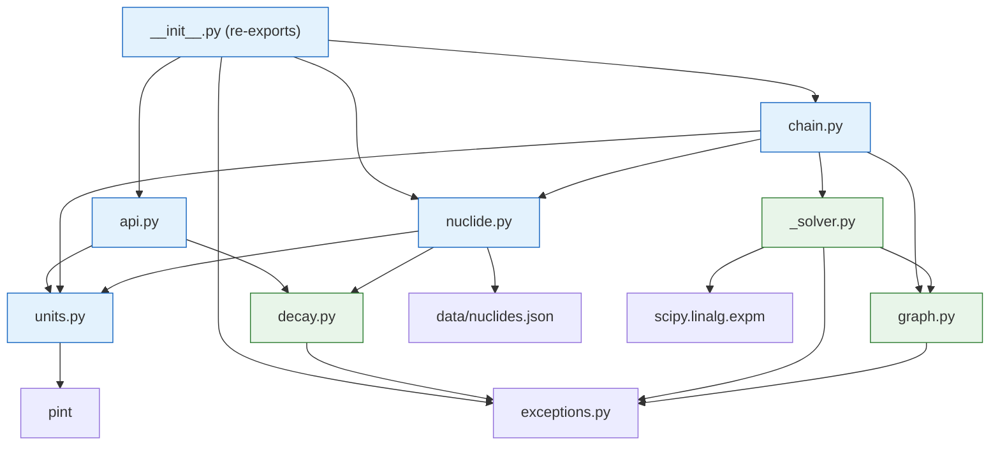
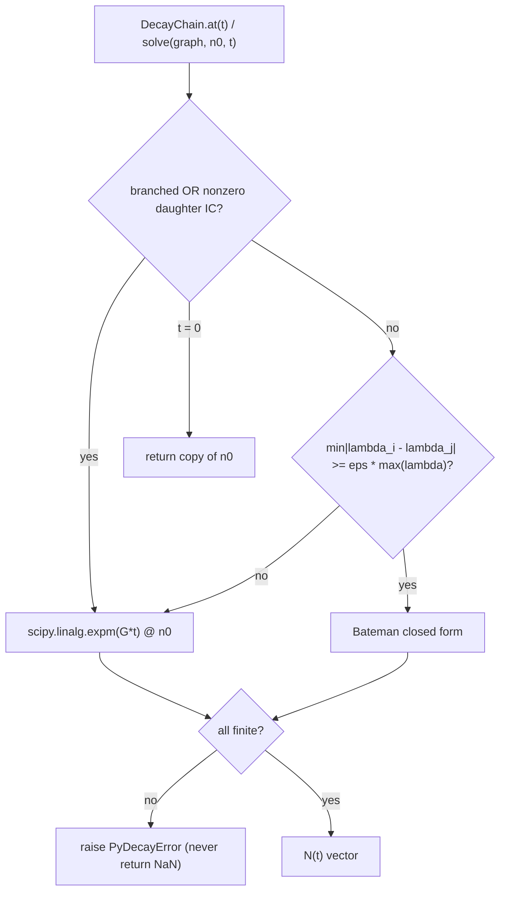
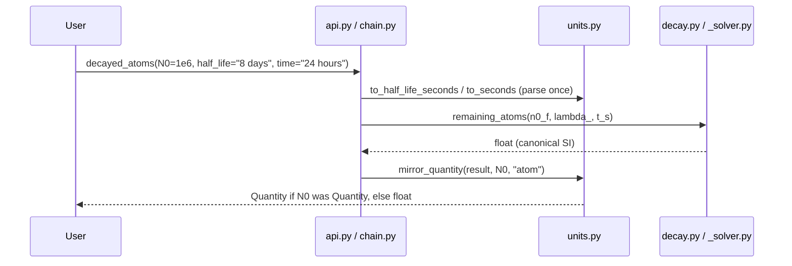

# pydecay v1 Implementation Plan

> **For agentic workers:** REQUIRED SUB-SKILL: Use superpowers:subagent-driven-development (recommended) or superpowers:executing-plans to implement this plan task-by-task. Steps use checkbox (`- [ ]`) syntax for tracking.

**Goal:** Build the `pydecay` package — analytical radioactive decay, Bateman/expm decay chains with branching, IAEA-sourced nuclide data, unit conversions — strictly test-first, with professional documentation and diagrams.

**Architecture:** Layered: pure-SI math kernels (`decay.py`, `graph.py`, `_solver.py`) never import pint; pint appears only at the domain/API edge (`units.py`, `nuclide.py`, `chain.py`, `api.py`, `__init__.py`). Solver dispatch: guarded Bateman closed form for well-separated linear parent-only cases; `scipy.linalg.expm` fallback otherwise (branching, degenerate λ, nonzero daughter ICs).

**Tech Stack:** Python ≥3.10; numpy, scipy, pint; hatchling; pytest + pytest-cov, ruff, mypy (strict); mkdocs-material; optional test dep `radioactivedecay`.

**Spec:** `docs/superpowers/specs/2026-09-22-pydecay-design.md` — executors read both. Locked signatures/literals below are intentional refinements reconciled with the spec at plan time. Third-party formats (IAEA API fields, radioactivedecay attributes) are explicitly flagged **fixture-verified**: the captured fixture/probe is ground truth; adapt field names only, never invent values.

## Global Constraints

- Python `>=3.10`; runtime deps exactly: `numpy`, `scipy`, `pint`.
- Internal canonical units: time = seconds (float), atoms = float, activity = Bq (float). Plain-float convention: `t` seconds, `A` Bq, `N` atoms.
- Constants: `N_A = 6.02214076e23` /mol (exact, 2019 SI); `1 Ci = 3.7e10 Bq` (exact); atom↔gram via `grams = N × mass_u / N_A`.
- Pure modules `decay.py`, `graph.py`, `_solver.py` must NOT import pint. Edge modules parse/mirror at their public surface only.
- Return-kind mirroring: result mirrors the primary numeric input (`N0`, `A0`, `n0`); string inputs on `t`/`half_life` never change output kind; `remaining_fraction` always returns plain float.
- Solver dispatch: Bateman iff graph is linear AND IC is parent-only AND `min|λᵢ−λⱼ| ≥ eps·max(λ)`, default `eps = 1e-8`; else expm. Generator convention `dN/dt = G @ N` with `G[i,i]=−λᵢ`, `G[i,j]+=λⱼfⱼᵢ` (destination row, source column — subdiagonal for linear chains; the reference doc's `A[i−1][i]` ordering is transposed relative to this convention and is NOT used).
- λ = 0 allowed only on terminal (all-zero outgoing row) species in chains; λ < 0 always rejected; single-isotope half-life must be > 0.
- Data: IAEA Live Chart only; no hand-typed half-lives; every bundled record carries `source`, `source_url`, `fetched`. Mandatory six: `Co-60, Cs-137, I-131, C-14, U-238, Tc-99m`.
- TDD Iron Law: no production code without a failing test first. TDD-exempt: config/boilerplate (pyproject, CI, LICENSE, .gitignore) and documentation prose/diagrams.
- Quality gate before every commit: `.venv\Scripts\python.exe -m pytest`, `.venv\Scripts\python.exe -m ruff check src tests`, `.venv\Scripts\python.exe -m mypy src`. Final gate (Task 13) adds coverage `fail_under = 90`, `mkdocs build --strict`, `python -m build`.
- All shell commands are PowerShell (win32). After Task 1, always use `.venv\Scripts\python.exe`.
- Commits: conventional (`feat:`, `test:`, `fix:`, `docs:`, `chore:`, `ci:`), one per task unless a step says otherwise.
- Every public class/function/method ships a Google-style docstring (enforced by ruff `D` rules).
- Network rule: if `nds.iaea.org` is unreachable during Task 6, STOP and report — never fabricate half-life values.

## File Structure (complete map)

| Path | Responsibility | Task |
|---|---|---|
| `pyproject.toml`, `.gitignore`, `LICENSE`, `.github/workflows/ci.yml` | build, deps, tool config, CI | 1 |
| `src/pydecay/__init__.py`, `py.typed` | version (1), full exports (10) | 1, 10 |
| `src/pydecay/exceptions.py` | `PyDecayError` hierarchy | 2 |
| `src/pydecay/units.py` | pint registry, parsing, conversions, mirroring | 3 |
| `src/pydecay/decay.py` | single-isotope closed form (pure SI) | 4 |
| `src/pydecay/nuclide.py` | `Nuclide` dataclass, record validation | 5 |
| `src/pydecay/data/_fetch_iaea.py` | IAEA fetch/parse tool (excluded from wheel) | 6 |
| `src/pydecay/data/nuclides.json` | bundled IAEA dataset (generated) | 6 |
| `src/pydecay/graph.py` | `DecayGraph`, generator matrix (pure SI) | 7 |
| `src/pydecay/_solver.py` | Bateman, expm, dispatch (pure SI) | 8 |
| `src/pydecay/chain.py` | `DecayChain` domain object (pint at edges) | 9 |
| `src/pydecay/api.py` | `decayed_atoms`, `decayed_activity`, `remaining_fraction` | 10 |
| `tests/test_smoke.py` … `test_crosscheck.py` | per-module + §6 + cross-check suites | each task |
| `tests/fixtures/iaea_groundstates_sample.json` | captured live API response | 6 |
| `README.md`, `CHANGELOG.md`, `CONTRIBUTING.md`, `SECURITY.md` | meta docs | 12 |
| `mkdocs.yml`, `docs/*.md`, `examples/quickstart.py` | docs site + diagrams + example | 12 |

---

### Task 1: Scaffold & tooling

**Files:**
- Create: `pyproject.toml`, `.gitignore`, `LICENSE`, `src/pydecay/__init__.py`, `src/pydecay/py.typed`, `.github/workflows/ci.yml`, `README.md` (stub)
- Test: `tests/test_smoke.py`

**Interfaces:**
- Consumes: nothing.
- Produces: `pydecay.__version__: str == "0.1.0"`; editable install in `.venv` with `[dev,test,docs]` extras; commands used by every later task.

- [ ] **Step 1: Write the failing smoke test**

```python
"""Package import smoke test."""


def test_package_imports():
    import pydecay

    assert pydecay.__version__ == "0.1.0"
```

- [ ] **Step 2: Run test to verify it fails**

Run: `python -m pytest tests/test_smoke.py -v` (venv does not exist yet)
Expected: FAIL with `ModuleNotFoundError: No module named 'pydecay'`

- [ ] **Step 3: Write scaffolding (config/boilerplate — TDD-exempt)**

`pyproject.toml`:

```toml
[build-system]
requires = ["hatchling"]
build-backend = "hatchling.build"

[project]
name = "pydecay"
dynamic = ["version"]
description = "Radioactive decay mathematics: analytical decay, Bateman chains with branching, and activity unit conversions"
readme = "README.md"
license = { text = "MIT" }
requires-python = ">=3.10"
authors = [{ name = "pydecay contributors" }]
keywords = ["radioactive", "decay", "bateman", "half-life", "activity", "nuclear", "radioactivity"]
classifiers = [
  "Development Status :: 3 - Alpha",
  "Intended Audience :: Science/Research",
  "License :: OSI Approved :: MIT License",
  "Operating System :: OS Independent",
  "Programming Language :: Python :: 3",
  "Programming Language :: Python :: 3.10",
  "Programming Language :: Python :: 3.11",
  "Programming Language :: Python :: 3.12",
  "Programming Language :: Python :: 3.13",
  "Topic :: Scientific/Engineering :: Physics",
  "Typing :: Typed",
]
dependencies = [
  "numpy>=1.23",
  "scipy>=1.9",
  "pint>=0.20",
]

[project.optional-dependencies]
test = ["pytest>=7.4", "pytest-cov>=4.1", "radioactivedecay>=0.1"]
docs = ["mkdocs-material>=9.5"]
dev = ["pytest>=7.4", "pytest-cov>=4.1", "ruff>=0.4", "mypy>=1.8", "build>=1.0"]

[tool.hatch.version]
path = "src/pydecay/__init__.py"

[tool.hatch.build.targets.wheel]
packages = ["src/pydecay"]
exclude = ["**/_fetch_iaea.py"]

[tool.pytest.ini_options]
testpaths = ["tests"]
addopts = "-q"

[tool.coverage.run]
source = ["pydecay"]
omit = ["*/data/_fetch_iaea.py"]
branch = false

[tool.coverage.report]
fail_under = 90
show_missing = true
exclude_lines = ["pragma: no cover", "if TYPE_CHECKING:"]

[tool.ruff]
line-length = 100
src = ["src", "tests"]

[tool.ruff.lint]
select = ["E", "F", "I", "UP", "B", "D", "RUF"]
ignore = ["D203", "D213"]

[tool.ruff.lint.pydocstyle]
convention = "google"

[tool.ruff.lint.per-file-ignores]
"tests/**" = ["D"]
"examples/**" = ["D"]

[tool.mypy]
python_version = "3.10"
strict = true
mypy_path = "src"
packages = ["pydecay"]

[[tool.mypy.overrides]]
module = "pint.*"
ignore_errors = true
```

`src/pydecay/__init__.py`:

```python
"""pydecay: radioactive decay mathematics."""

__version__ = "0.1.0"
```

`src/pydecay/py.typed`: empty file.

`.gitignore`:

```
__pycache__/
*.py[cod]
.venv/
dist/
build/
*.egg-info/
.pytest_cache/
.mypy_cache/
.ruff_cache/
.coverage
htmlcov/
site/
```

`LICENSE` (MIT):

```
MIT License

Copyright (c) 2026 pydecay contributors

Permission is hereby granted, free of charge, to any person obtaining a copy
of this software and associated documentation files (the "Software"), to deal
in the Software without restriction, including without limitation the rights
to use, copy, modify, merge, publish, distribute, sublicense, and/or sell
copies of the Software, and to permit persons to whom the Software is
furnished to do so, subject to the following conditions:

The above copyright notice and this permission notice shall be included in all
copies or substantial portions of the Software.

THE SOFTWARE IS PROVIDED "AS IS", WITHOUT WARRANTY OF ANY KIND, EXPRESS OR
IMPLIED, INCLUDING BUT NOT LIMITED TO THE WARRANTIES OF MERCHANTABILITY,
FITNESS FOR A PARTICULAR PURPOSE AND NONINFRINGEMENT. IN NO EVENT SHALL THE
AUTHORS OR COPYRIGHT HOLDERS BE LIABLE FOR ANY CLAIM, DAMAGES OR OTHER
LIABILITY, WHETHER IN AN ACTION OF CONTRACT, TORT OR OTHERWISE, ARISING FROM,
OUT OF OR IN CONNECTION WITH THE SOFTWARE OR THE USE OR OTHER DEALINGS IN THE
SOFTWARE.
```

`.github/workflows/ci.yml`:

```yaml
name: CI

on:
  push:
    branches: [main]
  pull_request:
    branches: [main]

jobs:
  lint:
    runs-on: ubuntu-latest
    steps:
      - uses: actions/checkout@v4
      - uses: actions/setup-python@v5
        with:
          python-version: "3.12"
      - run: python -m pip install -e ".[dev]"
      - run: ruff check src tests
      - run: mypy

  test:
    runs-on: ubuntu-latest
    strategy:
      matrix:
        python-version: ["3.10", "3.11", "3.12", "3.13"]
    steps:
      - uses: actions/checkout@v4
      - uses: actions/setup-python@v5
        with:
          python-version: ${{ matrix.python-version }}
      - run: python -m pip install -e ".[test]"
      - run: pytest --cov=pydecay --cov-report=term-missing

  docs:
    runs-on: ubuntu-latest
    steps:
      - uses: actions/checkout@v4
      - uses: actions/setup-python@v5
        with:
          python-version: "3.12"
      - run: python -m pip install -e ".[docs]"
      - run: mkdocs build --strict
```

`README.md` stub (full rewrite in Task 12):

```markdown
# pydecay

Radioactive decay mathematics for Python. See `docs/` for the full guide.
```

- [ ] **Step 4: Create venv and install editable with extras**

```powershell
python -m venv .venv
.venv\Scripts\python.exe -m pip install --upgrade pip
.venv\Scripts\python.exe -m pip install -e ".[dev,test,docs]"
```

- [ ] **Step 5: Run smoke test to verify it passes**

Run: `.venv\Scripts\python.exe -m pytest tests/test_smoke.py -v`
Expected: PASS

- [ ] **Step 6: Baseline lint/typecheck (must be clean)**

Run: `.venv\Scripts\python.exe -m ruff check src tests` → All checks passed
Run: `.venv\Scripts\python.exe -m mypy src` → Success

- [ ] **Step 7: Commit**

```powershell
git add pyproject.toml .gitignore LICENSE README.md .github/workflows/ci.yml src/pydecay tests/test_smoke.py
git commit -m "chore: scaffold pydecay package with tooling and CI"
```

---

### Task 2: Exception hierarchy

**Files:**
- Create: `src/pydecay/exceptions.py`
- Test: `tests/test_exceptions.py`

**Interfaces:**
- Consumes: nothing.
- Produces: `PyDecayError`, `NuclideNotFoundError`, `InvalidHalfLifeError`, `InvalidTimeError`, `ChainDefinitionError`, `UnitError`, `DataFormatError` — all subclass `PyDecayError(Exception)`; constructible with a single `str` message.

- [ ] **Step 1: Write the failing tests**

```python
"""Tests for the pydecay exception hierarchy."""

import pytest

from pydecay.exceptions import (
    ChainDefinitionError,
    DataFormatError,
    InvalidHalfLifeError,
    InvalidTimeError,
    NuclideNotFoundError,
    PyDecayError,
    UnitError,
)


@pytest.mark.parametrize(
    "exc_cls",
    [
        NuclideNotFoundError,
        InvalidHalfLifeError,
        InvalidTimeError,
        ChainDefinitionError,
        UnitError,
        DataFormatError,
    ],
)
def test_all_errors_subclass_pydecay_error(exc_cls):
    assert issubclass(exc_cls, PyDecayError)
    assert issubclass(exc_cls, Exception)


def test_errors_carry_message():
    with pytest.raises(InvalidTimeError, match="must be"):
        raise InvalidTimeError("time must be >= 0")
```

- [ ] **Step 2: Run tests to verify they fail**

Run: `.venv\Scripts\python.exe -m pytest tests/test_exceptions.py -v`
Expected: FAIL with `ModuleNotFoundError: No module named 'pydecay.exceptions'`

- [ ] **Step 3: Write minimal implementation**

```python
"""Exception hierarchy for pydecay.

All package-raised errors derive from :class:`PyDecayError` so callers can
catch a single base class.
"""


class PyDecayError(Exception):
    """Base class for all pydecay errors."""


class NuclideNotFoundError(PyDecayError):
    """Raised when a nuclide name is not present in the bundled dataset."""


class InvalidHalfLifeError(PyDecayError):
    """Raised when a half-life or decay constant is non-positive or non-finite."""


class InvalidTimeError(PyDecayError):
    """Raised when a time value is negative or non-finite."""


class ChainDefinitionError(PyDecayError):
    """Raised when a decay chain is malformed (empty, bad lengths, bad branching)."""


class UnitError(PyDecayError):
    """Raised when a value cannot be parsed or has the wrong dimension."""


class DataFormatError(PyDecayError):
    """Raised when a bundled data record is missing keys or has bad values."""
```

- [ ] **Step 4: Run tests to verify they pass**

Run: `.venv\Scripts\python.exe -m pytest tests/test_exceptions.py -v`
Expected: PASS

- [ ] **Step 5: Lint/typecheck, then commit**

```powershell
.venv\Scripts\python.exe -m ruff check src tests
.venv\Scripts\python.exe -m mypy src
git add src/pydecay/exceptions.py tests/test_exceptions.py
git commit -m "feat: add PyDecayError exception hierarchy"
```

---

### Task 3: units.py — pint registry, parsing, conversions, mirroring

**Files:**
- Create: `src/pydecay/units.py`
- Test: `tests/test_units.py`

**Interfaces:**
- Consumes: `UnitError`, `InvalidTimeError`, `InvalidHalfLifeError` (Task 2).
- Produces (locked):
  - `ureg: pint.UnitRegistry` (shared; defines `atom = 1`)
  - `AVOGADRO_PER_MOL: float = 6.02214076e23`
  - `CI_IN_BQ: float = 3.7e10`
  - `to_seconds(t: float | int | str | pint.Quantity) -> float` — finite, ≥ 0 else `InvalidTimeError`; bad unit → `UnitError`
  - `to_half_life_seconds(h: ...) -> float` — finite, > 0 else `InvalidHalfLifeError`
  - `to_float(value: ..., unit: str) -> float` — dimension check via `q.to(unit)`; plain numbers pass through as canonical; bad → `UnitError`
  - `mirror_quantity(value: float, like: object, unit: str) -> float | pint.Quantity` — Quantity in → `value * ureg(unit)`; else float
  - `atoms_to_grams(n_atoms: float, atomic_mass_u: float) -> float`, `grams_to_atoms(m_g, atomic_mass_u) -> float`
  - `bq_to_ci(bq: float) -> float`, `ci_to_bq(ci: float) -> float`

- [ ] **Step 1: Write the failing tests**

```python
"""Tests for unit parsing, conversion, and output mirroring."""

import math

import pint
import pytest

from pydecay.exceptions import InvalidHalfLifeError, InvalidTimeError, UnitError
from pydecay.units import (
    AVOGADRO_PER_MOL,
    CI_IN_BQ,
    atoms_to_grams,
    bq_to_ci,
    ci_to_bq,
    grams_to_atoms,
    mirror_quantity,
    to_float,
    to_half_life_seconds,
    to_seconds,
    ureg,
)


def test_to_seconds_plain_float_is_passthrough():
    assert to_seconds(90.0) == 90.0


def test_to_seconds_string():
    assert to_seconds("8.02 days") == pytest.approx(8.02 * 86400.0)
    assert to_seconds("2 hours") == 7200.0


def test_to_seconds_pint_quantity():
    assert to_seconds(2 * ureg.hour) == 7200.0
    assert to_seconds(ureg.Quantity(30, "minute")) == 1800.0


def test_to_seconds_rejects_negative():
    with pytest.raises(InvalidTimeError, match=">= 0"):
        to_seconds(-1.0)


def test_to_seconds_rejects_nonfinite():
    with pytest.raises(InvalidTimeError, match="finite"):
        to_seconds(math.nan)


def test_to_seconds_rejects_wrong_dimension():
    with pytest.raises(UnitError):
        to_seconds(5 * ureg.meter)


def test_to_seconds_rejects_garbage_string():
    with pytest.raises(UnitError):
        to_seconds("not a time")


def test_to_half_life_seconds_rejects_zero_and_negative():
    with pytest.raises(InvalidHalfLifeError):
        to_half_life_seconds(0.0)
    with pytest.raises(InvalidHalfLifeError):
        to_half_life_seconds("0 days")


def test_to_float_dimension_check():
    assert to_float(5.0, "becquerel") == 5.0
    assert to_float(1 * ureg.Ci, "becquerel") == pytest.approx(CI_IN_BQ)
    with pytest.raises(UnitError):
        to_float(1 * ureg.meter, "second")


def test_mirror_quantity_quantity_in_float_out():
    out = mirror_quantity(500.0, 1 * ureg.becquerel, "becquerel")
    assert isinstance(out, pint.Quantity)
    assert out.magnitude == pytest.approx(500.0)
    plain = mirror_quantity(500.0, 1.0, "becquerel")
    assert isinstance(plain, float)
    assert plain == 500.0


def test_atoms_grams_roundtrip():
    mass_u = 130.9061
    n = 1.0e18
    g = atoms_to_grams(n, mass_u)
    assert g == pytest.approx(n * mass_u / AVOGADRO_PER_MOL)
    assert grams_to_atoms(g, mass_u) == pytest.approx(n, rel=1e-12)


def test_ci_bq_exact_conversion():
    assert ci_to_bq(1.0) == 3.7e10
    assert bq_to_ci(3.7e10) == pytest.approx(1.0)
    assert bq_to_ci(ci_to_bq(2.5)) == pytest.approx(2.5)


def test_atom_unit_is_dimensionless_and_named():
    q = 3.0 * ureg.atom
    assert q.dimensionless
    assert to_float(q, "atom") == 3.0
```

- [ ] **Step 2: Run tests to verify they fail**

Run: `.venv\Scripts\python.exe -m pytest tests/test_units.py -v`
Expected: FAIL with `ModuleNotFoundError: No module named 'pydecay.units'`

- [ ] **Step 3: Write minimal implementation**

```python
"""Unit handling: the single conversion chokepoint.

Internal canonical units are seconds, atoms, and becquerels as plain floats.
pint appears only here and in other edge modules; parse on the way in,
:func:`mirror_quantity` on the way out.
"""

from __future__ import annotations

import math
from typing import Any

import pint

from pydecay.exceptions import InvalidHalfLifeError, InvalidTimeError, UnitError

ureg = pint.UnitRegistry()
ureg.define("atom = 1")

AVOGADRO_PER_MOL = 6.02214076e23
"""Avogadro constant in 1/mol (exact, 2019 SI redefinition)."""

CI_IN_BQ = 3.7e10
"""1 curie in becquerels (exact, NIST SP 811)."""


def _as_quantity(value: float | int | str | pint.Quantity) -> float | pint.Quantity:
    """Coerce numbers and unit strings to a pint Quantity or keep floats."""
    if isinstance(value, str):
        try:
            return ureg.Quantity(value)
        except (pint.errors.UndefinedUnitError, ValueError) as exc:
            raise UnitError(f"cannot parse quantity from {value!r}") from exc
    return value


def to_float(value: float | int | str | pint.Quantity, unit: str) -> float:
    """Return ``value`` as a canonical float in ``unit``.

    Plain numbers are assumed to already be in ``unit``. Strings and
    Quantities are converted; dimension mismatches raise :class:`UnitError`.
    """
    q = _as_quantity(value)
    if isinstance(q, pint.Quantity):
        try:
            return float(q.to(unit).magnitude)
        except (pint.DimensionalityError, pint.errors.UndefinedUnitError) as exc:
            raise UnitError(f"{value!r} is not a valid {unit}") from exc
    return float(q)


def to_seconds(t: float | int | str | pint.Quantity) -> float:
    """Parse a time into seconds; require finite and >= 0."""
    s = to_float(t, "second")
    if not math.isfinite(s):
        raise InvalidTimeError(f"time must be finite, got {s}")
    if s < 0:
        raise InvalidTimeError(f"time must be >= 0, got {s}")
    return s


def to_half_life_seconds(h: float | int | str | pint.Quantity) -> float:
    """Parse a half-life into seconds; require finite and > 0."""
    s = to_float(h, "second")
    if not math.isfinite(s):
        raise InvalidHalfLifeError(f"half-life must be finite, got {s}")
    if s <= 0:
        raise InvalidHalfLifeError(f"half-life must be > 0, got {s}")
    return s


def mirror_quantity(value: float, like: Any, unit: str) -> float | pint.Quantity:
    """Return ``value`` in the same representation kind as ``like``.

    If ``like`` is a pint Quantity, the result is ``value * ureg(unit)``;
    otherwise a plain float is returned.
    """
    if isinstance(like, pint.Quantity):
        return value * ureg(unit)
    return float(value)


def atoms_to_grams(n_atoms: float, atomic_mass_u: float) -> float:
    """Convert an atom count to grams via the nuclide's atomic mass in u."""
    return float(n_atoms) * float(atomic_mass_u) / AVOGADRO_PER_MOL


def grams_to_atoms(m_g: float, atomic_mass_u: float) -> float:
    """Convert grams to an atom count via the nuclide's atomic mass in u."""
    return float(m_g) * AVOGADRO_PER_MOL / float(atomic_mass_u)


def bq_to_ci(bq: float) -> float:
    """Convert becquerels to curies."""
    return float(bq) / CI_IN_BQ


def ci_to_bq(ci: float) -> float:
    """Convert curies to becquerels."""
    return float(ci) * CI_IN_BQ
```

- [ ] **Step 4: Run tests to verify they pass**

Run: `.venv\Scripts\python.exe -m pytest tests/test_units.py -v`
Expected: PASS

- [ ] **Step 5: Lint/typecheck, then commit**

```powershell
.venv\Scripts\python.exe -m ruff check src tests
.venv\Scripts\python.exe -m mypy src
git add src/pydecay/units.py tests/test_units.py
git commit -m "feat: add unit parsing, conversions, and output mirroring"
```

---

### Task 4: decay.py — single-isotope closed form (pure SI)

**Files:**
- Create: `src/pydecay/decay.py`
- Test: `tests/test_decay.py`

**Interfaces:**
- Consumes: exceptions (Task 2). **No pint.**
- Produces (locked):
  - `decay_constant(half_life_s: float) -> float` — `ln2 / T½`
  - `mean_lifetime_s(lambda_: float) -> float` — `1 / λ`
  - `remaining_fraction(lambda_: float, t_s: float) -> float` — `exp(−λt)`
  - `remaining_atoms(n0: float, lambda_: float, t_s: float) -> float`
  - `activity_bq(n_atoms: float, lambda_: float) -> float` — `λ · N`

- [ ] **Step 1: Write the failing tests**

```python
"""Tests for the single-isotope decay law (spec section 1)."""

import math

import pytest

from pydecay import decay
from pydecay.exceptions import InvalidHalfLifeError, InvalidTimeError, PyDecayError


def test_decay_constant_from_half_life():
    lam = decay.decay_constant(8.0)
    assert lam == pytest.approx(math.log(2) / 8.0)


def test_half_life_identity():
    """N(T_half) == N0 / 2 exactly to tight tolerance (spec 1.2)."""
    t_half = 12.5
    lam = decay.decay_constant(t_half)
    assert decay.remaining_fraction(lam, t_half) == pytest.approx(0.5, rel=1e-12)
    assert decay.remaining_atoms(1.0e9, lam, t_half) == pytest.approx(0.5e9, rel=1e-12)


def test_mean_lifetime_identity():
    """N(tau) == N0 / e (spec 1.2)."""
    t_half = 7.0
    lam = decay.decay_constant(t_half)
    tau = decay.mean_lifetime_s(lam)
    assert tau == pytest.approx(t_half / math.log(2))
    assert decay.remaining_fraction(lam, tau) == pytest.approx(1.0 / math.e, rel=1e-12)


def test_activity_is_lambda_n():
    lam = decay.decay_constant(100.0)
    assert decay.activity_bq(5.0e6, lam) == pytest.approx(lam * 5.0e6)


def test_activity_follows_same_exponential():
    lam = decay.decay_constant(100.0)
    n0, t = 1.0e6, 250.0
    a0 = decay.activity_bq(n0, lam)
    at = decay.activity_bq(decay.remaining_atoms(n0, lam, t), lam)
    assert at == pytest.approx(a0 * math.exp(-lam * t), rel=1e-15)


def test_t_zero_returns_input():
    lam = decay.decay_constant(100.0)
    assert decay.remaining_atoms(12345.0, lam, 0.0) == 12345.0


def test_rejects_bad_half_life():
    with pytest.raises(InvalidHalfLifeError):
        decay.decay_constant(0.0)
    with pytest.raises(InvalidHalfLifeError):
        decay.decay_constant(-3.0)
    with pytest.raises(InvalidHalfLifeError):
        decay.decay_constant(math.nan)


def test_rejects_negative_time():
    lam = decay.decay_constant(100.0)
    with pytest.raises(InvalidTimeError):
        decay.remaining_fraction(lam, -1.0)


def test_rejects_negative_atoms():
    lam = decay.decay_constant(100.0)
    with pytest.raises(PyDecayError):
        decay.remaining_atoms(-1.0, lam, 1.0)
```

- [ ] **Step 2: Run tests to verify they fail**

Run: `.venv\Scripts\python.exe -m pytest tests/test_decay.py -v`
Expected: FAIL with `ModuleNotFoundError: No module named 'pydecay.decay'`

- [ ] **Step 3: Write minimal implementation**

```python
"""Single-isotope analytical decay (spec section 1). Pure SI floats only.

Closed form ``N(t) = N0 * exp(-lambda * t)`` — never numerically integrated.
"""

from __future__ import annotations

import math

from pydecay.exceptions import InvalidHalfLifeError, InvalidTimeError, PyDecayError

LN2 = math.log(2.0)


def _validate_lambda(lambda_: float) -> float:
    """Require a finite positive decay constant."""
    if not math.isfinite(lambda_) or lambda_ <= 0:
        raise InvalidHalfLifeError(f"decay constant must be finite and > 0, got {lambda_}")
    return lambda_


def _validate_time(t_s: float) -> float:
    """Require a finite non-negative time in seconds."""
    if not math.isfinite(t_s):
        raise InvalidTimeError(f"time must be finite, got {t_s}")
    if t_s < 0:
        raise InvalidTimeError(f"time must be >= 0, got {t_s}")
    return t_s


def decay_constant(half_life_s: float) -> float:
    """Return lambda = ln(2) / T_half for a half-life in seconds."""
    if not math.isfinite(half_life_s) or half_life_s <= 0:
        raise InvalidHalfLifeError(f"half-life must be finite and > 0, got {half_life_s}")
    return LN2 / half_life_s


def mean_lifetime_s(lambda_: float) -> float:
    """Return the mean lifetime tau = 1 / lambda in seconds."""
    return 1.0 / _validate_lambda(lambda_)


def remaining_fraction(lambda_: float, t_s: float) -> float:
    """Return N(t)/N0 = exp(-lambda * t)."""
    lam = _validate_lambda(lambda_)
    t = _validate_time(t_s)
    return math.exp(-lam * t)


def remaining_atoms(n0: float, lambda_: float, t_s: float) -> float:
    """Return N(t) = N0 * exp(-lambda * t) for atom count ``n0``."""
    n = float(n0)
    if not math.isfinite(n) or n < 0:
        raise PyDecayError(f"N0 must be finite and >= 0, got {n0}")
    return n * remaining_fraction(lambda_, t_s)


def activity_bq(n_atoms: float, lambda_: float) -> float:
    """Return activity A = lambda * N in becquerels."""
    n = float(n_atoms)
    if not math.isfinite(n) or n < 0:
        raise PyDecayError(f"N must be finite and >= 0, got {n_atoms}")
    return _validate_lambda(lambda_) * n
```

- [ ] **Step 4: Run tests to verify they pass**

Run: `.venv\Scripts\python.exe -m pytest tests/test_decay.py -v`
Expected: PASS

- [ ] **Step 5: Lint/typecheck, then commit**

```powershell
.venv\Scripts\python.exe -m ruff check src tests
.venv\Scripts\python.exe -m mypy src
git add src/pydecay/decay.py tests/test_decay.py
git commit -m "feat: add single-isotope analytical decay"
```

---

### Task 5: nuclide.py — dataclass, record validation, name normalization

**Files:**
- Create: `src/pydecay/nuclide.py`, `src/pydecay/data/__init__.py`
- Test: `tests/test_nuclide.py`

**Interfaces:**
- Consumes: `DataFormatError`, `NuclideNotFoundError` (Task 2); `decay.decay_constant` (Task 4); `units.to_seconds`, `units.to_float`, `units.mirror_quantity`, `units.ureg` (Task 3).
- Produces (locked):
  - `normalize_nuclide_name(name: str) -> str` — accepts `i-131`/`I131`/`tc99m` → `I-131`/`Tc-99m`; unparseable → `DataFormatError`
  - `DecayMode` frozen dataclass: `mode: str`, `branch: float`
  - `Nuclide` frozen dataclass fields: `name`, `half_life_s: float`, `atomic_mass_u: float`, `decay_modes: tuple[DecayMode, ...]`, `source: str`, `source_url: str`, `fetched: str`, `half_life_uncertainty_s: float | None = None`
  - `Nuclide.from_record(name, record: dict) -> Nuclide` — required keys: `half_life_s`, `atomic_mass_u`, `decay_modes`, `source`, `source_url`, `fetched`; failures → `DataFormatError`
  - `Nuclide.load(name) -> Nuclide` (bundled; miss → `NuclideNotFoundError`), `Nuclide.load_all() -> dict[str, Nuclide]`
  - properties `lambda_ -> float`, `half_life -> pint.Quantity` (seconds)
  - method `activity(N, t=0) -> float | pint.Quantity` — mirrors `N`; `A = λ·N·exp(−λt)`
  - **Note:** `load`/`load_all` are only exercised against the real bundle in Task 6 (`test_data.py`); Task 5 tests use `from_record` so this task needs no dataset.

- [ ] **Step 1: Write the failing tests**

```python
"""Tests for Nuclide record validation and properties."""

import math

import pint
import pytest

from pydecay.exceptions import DataFormatError, InvalidTimeError, UnitError
from pydecay.nuclide import DecayMode, Nuclide, normalize_nuclide_name
from pydecay.units import ureg

GOOD_RECORD = {
    "half_life_s": 692256.0,
    "atomic_mass_u": 130.9061,
    "decay_modes": [{"mode": "beta-minus", "branch": 1.0}],
    "source": "SYNTHETIC TEST RECORD - not real data",
    "source_url": "https://example.invalid/fixture",
    "fetched": "2026-01-01",
    "half_life_uncertainty_s": None,
}


def test_normalize_name():
    assert normalize_nuclide_name("i-131") == "I-131"
    assert normalize_nuclide_name("I131") == "I-131"
    assert normalize_nuclide_name("Tc-99m") == "Tc-99m"
    assert normalize_nuclide_name("tc99m") == "Tc-99m"
    with pytest.raises(DataFormatError):
        normalize_nuclide_name("not a nuclide")


def test_from_record_ok():
    nuc = Nuclide.from_record("I-131", GOOD_RECORD)
    assert nuc.name == "I-131"
    assert nuc.half_life_s == 692256.0
    assert nuc.decay_modes == (DecayMode(mode="beta-minus", branch=1.0),)
    assert nuc.source.startswith("SYNTHETIC")
    assert nuc.half_life_uncertainty_s is None


def test_from_record_missing_key():
    rec = {k: v for k, v in GOOD_RECORD.items() if k != "source_url"}
    with pytest.raises(DataFormatError, match="source_url"):
        Nuclide.from_record("I-131", rec)


def test_from_record_bad_half_life():
    with pytest.raises(DataFormatError):
        Nuclide.from_record("X-1", {**GOOD_RECORD, "half_life_s": -5.0})
    with pytest.raises(DataFormatError):
        Nuclide.from_record("X-1", {**GOOD_RECORD, "half_life_s": "soon"})


def test_from_record_bad_decay_modes():
    with pytest.raises(DataFormatError):
        Nuclide.from_record("X-1", {**GOOD_RECORD, "decay_modes": "beta"})
    with pytest.raises(DataFormatError):
        Nuclide.from_record("X-1", {**GOOD_RECORD, "decay_modes": [{"mode": "x"}]})


def test_lambda_and_half_life_properties():
    nuc = Nuclide.from_record("I-131", GOOD_RECORD)
    assert nuc.lambda_ == pytest.approx(math.log(2) / 692256.0)
    assert isinstance(nuc.half_life, pint.Quantity)
    assert nuc.half_life.to("second").magnitude == pytest.approx(692256.0)


def test_activity_mirrors_n_and_decays():
    nuc = Nuclide.from_record("I-131", GOOD_RECORD)
    a_plain = nuc.activity(1.0e6, t=0.0)
    assert isinstance(a_plain, float)
    assert a_plain == pytest.approx(nuc.lambda_ * 1.0e6)
    a_t = nuc.activity(1.0e6, t=nuc.half_life_s)
    assert a_t == pytest.approx(a_plain * 0.5, rel=1e-12)
    a_q = nuc.activity(1.0e6 * ureg.atom)
    assert isinstance(a_q, pint.Quantity)
    with pytest.raises(UnitError):
        nuc.activity(1.0 * ureg.meter)
    with pytest.raises(InvalidTimeError):
        nuc.activity(1.0, t=-1.0)
```

- [ ] **Step 2: Run tests to verify they fail**

Run: `.venv\Scripts\python.exe -m pytest tests/test_nuclide.py -v`
Expected: FAIL with `ModuleNotFoundError: No module named 'pydecay.nuclide'`

- [ ] **Step 3: Write minimal implementation**

```python
"""Nuclide data model and bundled-dataset access (spec sections 3/7)."""

from __future__ import annotations

import json
import re
from dataclasses import dataclass
from importlib import resources
from typing import Any

from pydecay import decay
from pydecay.exceptions import DataFormatError, NuclideNotFoundError
from pydecay.units import mirror_quantity, to_float, to_seconds, ureg

_REQUIRED_KEYS = (
    "half_life_s",
    "atomic_mass_u",
    "decay_modes",
    "source",
    "source_url",
    "fetched",
)

_NAME_RE = re.compile(r"^([A-Za-z]{1,2})-?(\d{1,3})([mM]?)$")


def normalize_nuclide_name(name: str) -> str:
    """Normalize a nuclide name to canonical form like ``I-131`` or ``Tc-99m``."""
    m = _NAME_RE.fullmatch(name.strip())
    if m is None:
        raise DataFormatError(f"cannot parse nuclide name {name!r}")
    element = m.group(1)[0].upper() + m.group(1)[1:].lower()
    mass = m.group(2)
    meta = "m" if m.group(3) else ""
    return f"{element}-{mass}{meta}"


@dataclass(frozen=True)
class DecayMode:
    """A decay mode with its branching fraction."""

    mode: str
    branch: float


@dataclass(frozen=True)
class Nuclide:
    """One nuclide record from the bundled dataset.

    All times are SI seconds; atomic mass is in unified atomic mass units (u).
    """

    name: str
    half_life_s: float
    atomic_mass_u: float
    decay_modes: tuple[DecayMode, ...]
    source: str
    source_url: str
    fetched: str
    half_life_uncertainty_s: float | None = None

    @classmethod
    def from_record(cls, name: str, record: dict[str, Any]) -> Nuclide:
        """Build a validated :class:`Nuclide` from a raw JSON record."""
        norm = normalize_nuclide_name(name)
        for key in _REQUIRED_KEYS:
            if key not in record:
                raise DataFormatError(f"record for {norm} missing required key {key!r}")
        try:
            half_life_s = float(record["half_life_s"])  # type: ignore[arg-type]
            atomic_mass_u = float(record["atomic_mass_u"])  # type: ignore[arg-type]
        except (TypeError, ValueError) as exc:
            raise DataFormatError(f"record for {norm} has non-numeric mass/half-life") from exc
        if not (half_life_s > 0):
            raise DataFormatError(f"record for {norm} half_life_s must be > 0")
        raw_modes = record["decay_modes"]
        if not isinstance(raw_modes, list):
            raise DataFormatError(f"record for {norm} decay_modes must be a list")
        modes: list[DecayMode] = []
        for item in raw_modes:
            if not isinstance(item, dict) or "mode" not in item or "branch" not in item:
                raise DataFormatError(f"record for {norm} has malformed decay mode {item!r}")
            try:
                modes.append(DecayMode(mode=str(item["mode"]), branch=float(item["branch"])))
            except (TypeError, ValueError) as exc:
                raise DataFormatError(f"record for {norm} has non-numeric branch") from exc
        source = record["source"]
        source_url = record["source_url"]
        fetched = record["fetched"]
        if not all(isinstance(x, str) and x for x in (source, source_url, fetched)):
            raise DataFormatError(
                f"record for {norm} source/source_url/fetched must be non-empty strings"
            )
        unc = record.get("half_life_uncertainty_s")
        if unc is not None:
            try:
                unc = float(unc)
            except (TypeError, ValueError) as exc:
                raise DataFormatError(f"record for {norm} bad uncertainty") from exc
        return cls(
            name=norm,
            half_life_s=half_life_s,
            atomic_mass_u=atomic_mass_u,
            decay_modes=tuple(modes),
            source=source,
            source_url=source_url,
            fetched=fetched,
            half_life_uncertainty_s=unc,
        )

    @classmethod
    def _bundled_records(cls) -> dict[str, Any]:
        text = resources.files("pydecay.data").joinpath("nuclides.json").read_text(
            encoding="utf-8"
        )
        data = json.loads(text)
        if not isinstance(data, dict):
            raise DataFormatError("nuclides.json must be a JSON object")
        return data

    @classmethod
    def load(cls, name: str) -> Nuclide:
        """Load a nuclide from the bundled dataset by name (e.g. ``I-131``)."""
        norm = normalize_nuclide_name(name)
        records = cls._bundled_records()
        if norm not in records:
            raise NuclideNotFoundError(f"nuclide {norm!r} not found in bundled dataset")
        return cls.from_record(norm, records[norm])

    @classmethod
    def load_all(cls) -> dict[str, Nuclide]:
        """Load every nuclide from the bundled dataset."""
        return {norm: cls.from_record(norm, rec) for norm, rec in cls._bundled_records().items()}

    @property
    def lambda_(self) -> float:
        """Decay constant in 1/s."""
        return decay.decay_constant(self.half_life_s)

    @property
    def half_life(self) -> Any:
        """Half-life as a pint Quantity in seconds."""
        return self.half_life_s * ureg.second

    def activity(self, N: float | Any, t: float | str | Any = 0) -> float | Any:
        """Return A(t) = lambda * N * exp(-lambda * t) in Bq, mirroring ``N``'s kind."""
        n_atoms = to_float(N, "atom")
        t_s = to_seconds(t)
        a = self.lambda_ * n_atoms * decay.remaining_fraction(self.lambda_, t_s)
        return mirror_quantity(a, N, "becquerel")
```

`src/pydecay/data/__init__.py`:

```python
"""Bundled data files for pydecay."""
```

- [ ] **Step 4: Run tests to verify they pass**

Run: `.venv\Scripts\python.exe -m pytest tests/test_nuclide.py -v`
Expected: PASS

- [ ] **Step 5: Lint/typecheck, then commit**

```powershell
.venv\Scripts\python.exe -m ruff check src tests
.venv\Scripts\python.exe -m mypy src
git add src/pydecay/nuclide.py src/pydecay/data/__init__.py tests/test_nuclide.py
git commit -m "feat: add Nuclide dataclass and record validation"
```

---

### Task 6: IAEA dataset — probe, parser (fixture-verified), fetch, bundled JSON

**Files:**
- Create: `src/pydecay/data/_fetch_iaea.py`, `tests/fixtures/iaea_groundstates_sample.json`, `tests/test_fetch_parser.py`, `tests/test_data.py`
- Create (generated): `src/pydecay/data/nuclides.json`

**Interfaces:**
- Consumes: `Nuclide.from_record`/`load`/`load_all` (Task 5); `DataFormatError`.
- Produces:
  - bundled `nuclides.json`: normalized name → record with exactly the Task 5 schema; includes mandatory six `Co-60, Cs-137, I-131, C-14, U-238, Tc-99m`
  - `_fetch_iaea.MANDATORY_ISOTOPES: tuple[str, ...]`, `_fetch_iaea.ISOTOPES: tuple[str, ...]` (~45 names)
  - `_fetch_iaea.half_life_to_seconds(value: str, unit: str) -> float` with unit map: `ys/zs/as/fs/ps/ns/us/ms/s/m/h/d/y/ky/My/Gy` where `y = 31557600.0` s (Julian year, 365.25 d — documented in the module docstring); unknown unit → `DataFormatError`
  - `_fetch_iaea.parse_groundstate(record: dict) -> dict` (bundled schema; `decay_modes` = `[]` — see note)
  - atomic mass from `mass_excess`: `atomic_mass_u = a + mass_excess_v / 931494.10242` (keV per u; `mass_excess_u` fixture-verified as keV)

**Fixture-verification rule:** Step 1 captures a real API response; the fixture is ground truth for field names. Tests below assume `half_life_v`/`half_life_u`/`mass_excess_v`/`a`. If the fixture differs, update test literals and parser field names to match — locked signatures stay. Never invent values.

**Decay-modes note:** v1 records `decay_modes: []` (key present, honest emptiness) because the groundstates endpoint does not carry branches; branching fractions are user-supplied to `DecayChain.branching`. Document this limitation in `docs/data-sources.md` (Task 12). If a live `decays` endpoint is discovered during Step 1 probing, parsing it is a bonus — not required to pass.

- [ ] **Step 1: Probe the live API and capture a fixture (network required)**

```powershell
.venv\Scripts\python.exe -c "import json, urllib.request, pathlib; url='https://nds.iaea.org/relnsd/api/data/groundstates?nuclides=I-131'; raw=urllib.request.urlopen(url, timeout=30).read(); pathlib.Path('tests/fixtures').mkdir(parents=True, exist_ok=True); pathlib.Path('tests/fixtures/iaea_groundstates_sample.json').write_bytes(raw); data=json.loads(raw); print(type(data).__name__, len(data)); print(sorted(data[0].keys())); print(json.dumps(data[0], indent=2)[:2000])"
```

Expected: prints a list of records with keys; fixture file created.
**If the network call fails (timeout/HTTP error): STOP this task. Report to the user: access to nds.iaea.org is required — do not fabricate half-life values.**

- [ ] **Step 2: Reconcile parser test literals with the captured fixture**

Read `tests/fixtures/iaea_groundstates_sample.json`. Confirm the field names used in Steps 3–5 (`half_life_v`, `half_life_u`, `mass_excess_v`, `a`). If any differ, apply the observed names consistently to tests and parser (signatures unchanged). Note every distinct `half_life_u` value present; extend `UNIT_TO_SECONDS` with the table from Interfaces for each — an unknown unit must make the parser raise `DataFormatError` (extending the map is a conscious, tested act).

- [ ] **Step 3: Write the failing parser tests**

`tests/test_fetch_parser.py`:

```python
"""Tests for the IAEA fetch parser (run against a captured live fixture)."""

import datetime
import json
from pathlib import Path

import pytest

from pydecay.data._fetch_iaea import half_life_to_seconds, parse_groundstate
from pydecay.exceptions import DataFormatError

FIXTURE = Path(__file__).parent / "fixtures" / "iaea_groundstates_sample.json"


@pytest.fixture(scope="module")
def sample_record():
    data = json.loads(FIXTURE.read_text(encoding="utf-8"))
    assert isinstance(data, list) and data, "fixture must be a non-empty list"
    return data[0]


def test_fixture_contains_expected_isotope(sample_record):
    joined = " ".join(str(v) for v in sample_record.values())
    assert "131" in joined


def test_half_life_units():
    assert half_life_to_seconds("8.02", "d") == pytest.approx(8.02 * 86400.0)
    assert half_life_to_seconds("6.01", "h") == pytest.approx(6.01 * 3600.0)
    assert half_life_to_seconds("5.27", "y") == pytest.approx(5.27 * 31557600.0)
    assert half_life_to_seconds("15", "ms") == pytest.approx(0.015)
    with pytest.raises(DataFormatError):
        half_life_to_seconds("5", "fortnights")
    with pytest.raises(DataFormatError):
        half_life_to_seconds("not-a-number", "d")


def test_parse_groundstate_produces_schema_record(sample_record):
    rec = parse_groundstate(sample_record)
    for key in (
        "half_life_s",
        "atomic_mass_u",
        "decay_modes",
        "source",
        "source_url",
        "fetched",
    ):
        assert key in rec, f"missing {key}"
    assert rec["half_life_s"] > 0
    assert rec["atomic_mass_u"] > 0
    assert rec["source"].startswith("IAEA")
    assert "nds.iaea.org" in rec["source_url"]
    datetime.date.fromisoformat(rec["fetched"])
    assert isinstance(rec["decay_modes"], list)


def test_parse_groundstate_rejects_missing_half_life():
    with pytest.raises(DataFormatError):
        parse_groundstate({"half_life_v": "", "half_life_u": "y", "a": "131"})
    with pytest.raises(DataFormatError):
        parse_groundstate({"a": "131", "stable": "true"})
```

- [ ] **Step 4: Run parser tests to verify they fail**

Run: `.venv\Scripts\python.exe -m pytest tests/test_fetch_parser.py -v`
Expected: FAIL with `ModuleNotFoundError` for `pydecay.data._fetch_iaea`

- [ ] **Step 5: Write the fetch script with parser**

`src/pydecay/data/_fetch_iaea.py`:

```python
"""Fetch curated nuclide data from the IAEA Live Chart API.

Build-time tool: not part of the installed package (excluded from the wheel).
Writes ``nuclides.json`` next to this file. Half-lives are never hand-typed;
every value comes from the API response, stamped with today's UTC date.

Year convention: 1 y = 31557600 s (Julian year, 365.25 d).
Field names are verified against tests/fixtures/iaea_groundstates_sample.json.
"""

from __future__ import annotations

import datetime
import json
import sys
import urllib.request
from pathlib import Path
from typing import Any

from pydecay.exceptions import DataFormatError

API = "https://nds.iaea.org/relnsd/api/data/groundstates?nuclides={name}"
SOURCE = "IAEA Live Chart of Nuclides (nds.iaea.org)"
SOURCE_URL = "https://nds.iaea.org/relnsd/vcharthtml/VChartHTML.html"
OUT_PATH = Path(__file__).resolve().parent / "nuclides.json"

KEV_PER_U = 931494.10242

UNIT_TO_SECONDS: dict[str, float] = {
    "ys": 1e-24,
    "zs": 1e-21,
    "as": 1e-18,
    "fs": 1e-15,
    "ps": 1e-12,
    "ns": 1e-9,
    "us": 1e-6,
    "ms": 1e-3,
    "s": 1.0,
    "m": 60.0,
    "h": 3600.0,
    "d": 86400.0,
    "y": 31557600.0,
    "ky": 3.15576e10,
    "My": 3.15576e13,
    "Gy": 3.15576e16,
}

MANDATORY_ISOTOPES: tuple[str, ...] = (
    "Co-60",
    "Cs-137",
    "I-131",
    "C-14",
    "U-238",
    "Tc-99m",
)

ISOTOPES: tuple[str, ...] = (
    "F-18", "Ga-68", "Tc-99m", "Tc-99", "I-131", "I-125", "I-123",
    "Lu-177", "Y-90", "In-111", "Tl-201", "C-11", "Ra-223", "P-32",
    "Co-60", "Cs-137", "Cs-134", "Ir-192", "Sr-90", "Kr-85", "Ar-39",
    "Am-241", "Po-210", "Pb-210", "Rn-222", "Ra-226", "Ra-224",
    "Th-232", "U-238", "U-235", "Pu-239",
    "C-14", "H-3", "K-40", "Ca-45", "S-35",
    "Na-24", "Fe-59", "Co-57", "Zn-65", "Mn-54", "Cr-51", "Se-75",
    "Th-234", "Pa-234m", "U-234", "Th-230",
)


def half_life_to_seconds(value: str, unit: str) -> float:
    """Convert an IAEA half-life value/unit pair to seconds."""
    try:
        v = float(value)
    except (TypeError, ValueError) as exc:
        raise DataFormatError(f"non-numeric half-life value {value!r}") from exc
    if unit not in UNIT_TO_SECONDS:
        raise DataFormatError(f"unknown half-life unit {unit!r}")
    seconds = v * UNIT_TO_SECONDS[unit]
    if not (seconds > 0):
        raise DataFormatError(f"half-life must be > 0, got {seconds}")
    return seconds


def parse_groundstate(record: dict[str, Any]) -> dict[str, Any]:
    """Convert one API groundstate record into the bundled nuclides.json schema."""
    today = datetime.date.today().isoformat()
    hl_v = record.get("half_life_v")
    hl_u = record.get("half_life_u")
    if not hl_v or not hl_u:
        raise DataFormatError(f"record missing half-life fields: {record!r}")
    half_life_s = half_life_to_seconds(str(hl_v), str(hl_u))
    try:
        mass_excess_kev = float(record["mass_excess_v"])
    except (KeyError, TypeError, ValueError) as exc:
        raise DataFormatError(f"record missing usable mass_excess_v: {record!r}") from exc
    try:
        mass_number = float(record["a"])
    except (KeyError, TypeError, ValueError) as exc:
        raise DataFormatError(f"record missing mass number a: {record!r}") from exc
    atomic_mass_u = mass_number + mass_excess_kev / KEV_PER_U
    if not (atomic_mass_u > 0):
        raise DataFormatError(f"non-positive atomic mass for {record!r}")
    return {
        "half_life_s": half_life_s,
        "atomic_mass_u": atomic_mass_u,
        "decay_modes": [],
        "source": SOURCE,
        "source_url": SOURCE_URL,
        "fetched": today,
        "half_life_uncertainty_s": None,
    }


def fetch_one(name: str) -> dict[str, Any]:
    """Fetch and parse a single nuclide record from the live API."""
    from pydecay.nuclide import normalize_nuclide_name

    norm = normalize_nuclide_name(name)
    with urllib.request.urlopen(API.format(name=norm.lower()), timeout=30) as resp:
        data = json.loads(resp.read().decode("utf-8"))
    if not isinstance(data, list) or not data:
        raise DataFormatError(f"no groundstate data returned for {norm}")
    return parse_groundstate(data[0])


def main() -> int:
    """Fetch all curated isotopes and write nuclides.json. Returns exit code."""
    out: dict[str, Any] = {}
    failures: list[str] = []
    for name in ISOTOPES:
        try:
            out[name] = fetch_one(name)
        except Exception as exc:  # noqa: BLE001 - report and continue per-isotope
            failures.append(f"{name}: {exc}")
    missing_mandatory = [m for m in MANDATORY_ISOTOPES if m not in out]
    if missing_mandatory:
        print("FATAL: mandatory isotopes failed:", ", ".join(missing_mandatory), file=sys.stderr)
        for f in failures:
            print(f"  {f}", file=sys.stderr)
        return 1
    for f in failures:
        print(f"WARN skipped: {f}", file=sys.stderr)
    OUT_PATH.write_text(json.dumps(out, indent=2, sort_keys=True) + "\n", encoding="utf-8")
    print(f"Wrote {len(out)} nuclides to {OUT_PATH} ({len(failures)} skipped)")
    return 0


if __name__ == "__main__":
    raise SystemExit(main())
```

- [ ] **Step 6: Run parser tests to verify they pass**

Run: `.venv\Scripts\python.exe -m pytest tests/test_fetch_parser.py -v`
Expected: PASS (adjust only field-name literals per Step 2's fixture truth if needed; re-run to green)

- [ ] **Step 7: Write the failing bundled-data tests**

`tests/test_data.py`:

```python
"""Tests for the bundled IAEA dataset (schema + provenance + mandatory six)."""

import datetime

import pytest

from pydecay.exceptions import NuclideNotFoundError
from pydecay.nuclide import Nuclide

MANDATORY = ["Co-60", "Cs-137", "I-131", "C-14", "U-238", "Tc-99m"]


@pytest.fixture(scope="module")
def all_nuclides():
    return Nuclide.load_all()


def test_dataset_is_nonempty_and_reasonably_sized(all_nuclides):
    assert len(all_nuclides) >= 30


def test_mandatory_six_present(all_nuclides):
    for name in MANDATORY:
        assert name in all_nuclides, f"missing mandatory isotope {name}"


def test_every_record_has_provenance(all_nuclides):
    for nuc in all_nuclides.values():
        assert "IAEA" in nuc.source
        assert "nds.iaea.org" in nuc.source_url
        datetime.date.fromisoformat(nuc.fetched)


def test_every_half_life_positive(all_nuclides):
    for nuc in all_nuclides.values():
        assert nuc.half_life_s > 0
        assert nuc.atomic_mass_u > 0


def test_load_by_name(all_nuclides):
    i131 = Nuclide.load("I-131")
    assert i131.half_life_s == pytest.approx(all_nuclides["I-131"].half_life_s)
    assert Nuclide.load("i131").name == "I-131"


def test_load_missing_raises():
    with pytest.raises(NuclideNotFoundError):
        Nuclide.load("Xx-999")
```

- [ ] **Step 8: Run bundled-data tests to verify they fail**

Run: `.venv\Scripts\python.exe -m pytest tests/test_data.py -v`
Expected: FAIL — `nuclides.json` does not exist yet (FileNotFoundError or equivalent)

- [ ] **Step 9: Run the live fetch to generate nuclides.json**

Run: `.venv\Scripts\python.exe -m pydecay.data._fetch_iaea`
Expected: `Wrote N nuclides to .../nuclides.json`, exit code 0.
**If the network call fails: STOP and report to the user — do not fabricate values.**

- [ ] **Step 10: Run bundled-data tests to verify they pass**

Run: `.venv\Scripts\python.exe -m pytest tests/test_data.py -v`
Expected: PASS

- [ ] **Step 11: Full suite + gates, then commit**

```powershell
.venv\Scripts\python.exe -m pytest
.venv\Scripts\python.exe -m ruff check src tests
.venv\Scripts\python.exe -m mypy src
git add src/pydecay/data/_fetch_iaea.py src/pydecay/data/nuclides.json tests/test_data.py tests/test_fetch_parser.py tests/fixtures/iaea_groundstates_sample.json
git commit -m "feat: bundle IAEA-sourced nuclide dataset with provenance metadata"
```

---

### Task 7: graph.py — DecayGraph and generator matrix (pure SI)

**Files:**
- Create: `src/pydecay/graph.py`
- Test: `tests/test_graph.py`

**Interfaces:**
- Consumes: `ChainDefinitionError` (Task 2). **No pint.** numpy only inside `generator()`.
- Produces (locked):
  - `DecayGraph` frozen dataclass: `lambdas: tuple[float, ...]`, `names: tuple[str, ...]`, `fractions: tuple[tuple[float, ...], ...]`
  - `DecayGraph.linear(lambdas, names=None)` — superdiagonal ones; default names `species-1..n`
  - `DecayGraph.branching(lambdas, fractions, names=None)` — explicit matrix
  - validation in `__post_init__`: n ≥ 1; lengths match; λ finite ≥ 0; λ = 0 only if that species' row sums to 0 (terminal) else `ChainDefinitionError` (match=`"terminal"`); entries finite ≥ 0; each row sum ≤ 1 + 1e-12 else `ChainDefinitionError` (match=`"sum"`)
  - `is_branched: bool` — True iff `fractions` ≠ linear pattern
  - `generator() -> np.ndarray` — `G[i,i] = −λᵢ`; `G[i,j] += λⱼ·fⱼᵢ` (i ≠ j)
  - `min_separation() -> float` — `inf` when n = 1

- [ ] **Step 1: Write the failing tests**

```python
"""Tests for DecayGraph construction and the generator matrix."""

import numpy as np
import pytest

from pydecay.exceptions import ChainDefinitionError
from pydecay.graph import DecayGraph


def test_linear_three_chain_structure():
    g = DecayGraph.linear([0.6, 0.3, 0.1], names=["A", "B", "C"])
    assert g.names == ("A", "B", "C")
    assert not g.is_branched
    assert g.fractions[0][1] == 1.0
    assert g.fractions[1][2] == 1.0
    assert g.fractions[0][2] == 0.0


def test_linear_default_names():
    g = DecayGraph.linear([1.0, 2.0])
    assert g.names == ("species-1", "species-2")


def test_generator_linear_orientation():
    """dN/dt = G @ N: parent feeds daughter (subdiagonal), not the reverse."""
    g = DecayGraph.linear([2.0, 5.0])
    G = g.generator()
    assert G[0, 0] == pytest.approx(-2.0)
    assert G[1, 1] == pytest.approx(-5.0)
    assert G[1, 0] == pytest.approx(2.0)
    assert G[0, 1] == pytest.approx(0.0)


def test_generator_branching_rows():
    fractions = ((0.0, 0.6, 0.3), (0.0, 0.0, 0.0), (0.0, 0.0, 0.0))
    g = DecayGraph.branching((1.0, 0.5, 0.25), fractions, names=["P", "D1", "D2"])
    assert g.is_branched
    G = g.generator()
    assert G[0, 0] == pytest.approx(-1.0)
    assert G[1, 0] == pytest.approx(0.6)
    assert G[2, 0] == pytest.approx(0.3)


def test_stable_terminal_lambda_zero_allowed():
    g = DecayGraph.linear([1.0, 0.0], names=["A", "stable"])
    assert g.lambdas[1] == 0.0


def test_lambda_zero_on_nonterminal_rejected():
    fractions = ((1.0, 0.0), (0.0, 0.0))
    with pytest.raises(ChainDefinitionError, match="terminal"):
        DecayGraph.branching((0.0, 1.0), fractions)


def test_negative_lambda_rejected():
    with pytest.raises(ChainDefinitionError):
        DecayGraph.linear([-1.0])


def test_branching_fraction_sum_over_one_rejected():
    with pytest.raises(ChainDefinitionError, match="sum"):
        DecayGraph.branching(
            (1.0, 1.0, 1.0),
            ((0.0, 0.7, 0.7), (0.0, 0.0, 0.0), (0.0, 0.0, 0.0)),
        )


def test_mismatched_lengths_rejected():
    with pytest.raises(ChainDefinitionError):
        DecayGraph.linear([1.0], names=["A", "B"])


def test_empty_rejected():
    with pytest.raises(ChainDefinitionError):
        DecayGraph.linear([])


def test_min_separation():
    assert DecayGraph.linear([0.6931, 0.6932]).min_separation() == pytest.approx(1e-4)
    assert DecayGraph.linear([5.0]).min_separation() == float("inf")


def test_generator_dtype_and_shape():
    g = DecayGraph.linear([1.0, 2.0, 3.0])
    G = g.generator()
    assert G.shape == (3, 3)
    assert G.dtype == np.float64
    assert np.all(np.diag(G) <= 0)
```

- [ ] **Step 2: Run tests to verify they fail**

Run: `.venv\Scripts\python.exe -m pytest tests/test_graph.py -v`
Expected: FAIL with `ModuleNotFoundError: No module named 'pydecay.graph'`

- [ ] **Step 3: Write minimal implementation**

```python
"""Species/branching graph and decay generator matrix (spec section 4.2). Pure SI."""

from __future__ import annotations

from dataclasses import dataclass
from typing import Sequence

import numpy as np

from pydecay.exceptions import ChainDefinitionError

_FRACTION_TOL = 1e-12


def _is_linear_pattern(n: int, fractions: tuple[tuple[float, ...], ...]) -> bool:
    for j in range(n):
        for i in range(n):
            expected = 1.0 if i == j + 1 else 0.0
            if abs(fractions[j][i] - expected) > _FRACTION_TOL:
                return False
    return True


@dataclass(frozen=True)
class DecayGraph:
    """A decay topology: decay constants plus branching fractions.

    ``fractions[j][i]`` is the fraction of species j's decays that go to
    species i. Rows summing to < 1 leave the remainder as decay to an
    untracked sink. ``lambdas[j] == 0`` is allowed only for terminal species
    (all-zero row) and denotes a stable nuclide.
    """

    lambdas: tuple[float, ...]
    names: tuple[str, ...]
    fractions: tuple[tuple[float, ...], ...]

    def __post_init__(self) -> None:
        n = len(self.lambdas)
        if n == 0:
            raise ChainDefinitionError("graph must contain at least one species")
        if len(self.names) != n or len(self.fractions) != n:
            raise ChainDefinitionError("lambdas, names, and fractions must have equal length")
        for lam in self.lambdas:
            if not (lam >= 0) or lam == float("inf"):
                raise ChainDefinitionError(f"lambda must be finite and >= 0, got {lam}")
        for j, row in enumerate(self.fractions):
            if len(row) != n:
                raise ChainDefinitionError(f"fractions row {j} must have length {n}")
            row_sum = 0.0
            for i, f in enumerate(row):
                if not (f >= 0) or f == float("inf"):
                    raise ChainDefinitionError(f"fractions[{j}][{i}] must be finite and >= 0")
                row_sum += f
            if row_sum > 1.0 + _FRACTION_TOL:
                raise ChainDefinitionError(
                    f"branching fractions for species {j} sum to {row_sum} > 1"
                )
            if self.lambdas[j] == 0.0 and row_sum > _FRACTION_TOL:
                raise ChainDefinitionError(
                    f"species {j} has lambda = 0 but outgoing branches; "
                    "stable species must be terminal"
                )

    @classmethod
    def linear(
        cls, lambdas: Sequence[float], names: Sequence[str] | None = None
    ) -> DecayGraph:
        """Build an unbranched linear chain 1 → 2 → … → n."""
        lam = tuple(float(x) for x in lambdas)
        n = len(lam)
        if names is None:
            nm = tuple(f"species-{i + 1}" for i in range(n))
        else:
            nm = tuple(names)
        fr = tuple(
            tuple(1.0 if i == j + 1 else 0.0 for i in range(n)) for j in range(n)
        )
        return cls(lambdas=lam, names=nm, fractions=fr)

    @classmethod
    def branching(
        cls,
        lambdas: Sequence[float],
        fractions: Sequence[Sequence[float]],
        names: Sequence[str] | None = None,
    ) -> DecayGraph:
        """Build a graph from an explicit branching-fraction matrix."""
        lam = tuple(float(x) for x in lambdas)
        fr = tuple(tuple(float(x) for x in row) for row in fractions)
        if names is None:
            nm = tuple(f"species-{i + 1}" for i in range(len(lam)))
        else:
            nm = tuple(names)
        return cls(lambdas=lam, names=nm, fractions=fr)

    @property
    def is_branched(self) -> bool:
        """True when the topology is not a plain linear chain."""
        return not _is_linear_pattern(len(self.lambdas), self.fractions)

    def generator(self) -> np.ndarray:
        """Return G such that dN/dt = G @ N (destination rows, source columns)."""
        n = len(self.lambdas)
        G = np.zeros((n, n), dtype=np.float64)
        for j in range(n):
            G[j, j] = -self.lambdas[j]
            for i in range(n):
                if i != j and self.fractions[j][i] > 0.0:
                    G[i, j] += self.lambdas[j] * self.fractions[j][i]
        return G

    def min_separation(self) -> float:
        """Minimum pairwise |lambda_i - lambda_j| (inf for a single species)."""
        n = len(self.lambdas)
        if n < 2:
            return float("inf")
        best = float("inf")
        for i in range(n):
            for j in range(i + 1, n):
                best = min(best, abs(self.lambdas[i] - self.lambdas[j]))
        return best
```

- [ ] **Step 4: Run tests to verify they pass**

Run: `.venv\Scripts\python.exe -m pytest tests/test_graph.py -v`
Expected: PASS

- [ ] **Step 5: Lint/typecheck, then commit**

```powershell
.venv\Scripts\python.exe -m ruff check src tests
.venv\Scripts\python.exe -m mypy src
git add src/pydecay/graph.py tests/test_graph.py
git commit -m "feat: add DecayGraph and generator matrix"
```

---

### Task 8: _solver.py — guarded Bateman + expm dispatch (pure SI)

**Files:**
- Create: `src/pydecay/_solver.py`
- Test: `tests/test_solver.py`

**Interfaces:**
- Consumes: `DecayGraph` (Task 7); exceptions (Task 2); `scipy.linalg.expm`, `numpy`. **No pint.**
- Produces (locked):
  - `DEGENERATE_EPS: float = 1e-8`
  - `use_bateman(graph, n0, eps=DEGENERATE_EPS) -> bool` — True iff linear AND parent-only IC (`n0[i] == 0` for all i ≥ 1) AND `min_separation() >= eps * max(lambdas)`
  - `bateman_closed_form(lambdas, n0_parent, t_s) -> np.ndarray` — Bateman 1910 series; non-finite or zero denominator → `PyDecayError`
  - `solve(graph, n0, t_s, eps=DEGENERATE_EPS) -> np.ndarray` — validates: length mismatch → `ChainDefinitionError`; atoms finite ≥ 0 → else `PyDecayError`; t finite ≥ 0 → else `InvalidTimeError`; t=0 → copy; dispatch; non-finite result → `PyDecayError`

- [ ] **Step 1: Write the failing tests**

```python
"""Tests for solver dispatch, Bateman, expm, and stability regressions."""

import numpy as np
import pytest
from scipy.linalg import expm

from pydecay._solver import DEGENERATE_EPS, bateman_closed_form, solve, use_bateman
from pydecay.exceptions import ChainDefinitionError, InvalidTimeError, PyDecayError
from pydecay.graph import DecayGraph


def _expm_reference(graph, n0, t_s):
    return expm(graph.generator() * t_s) @ np.asarray(n0, dtype=np.float64)


def test_single_species_matches_exponential():
    g = DecayGraph.linear([0.693])
    out = solve(g, [1.0], 1.0)
    assert out[0] == pytest.approx(np.exp(-0.693), rel=1e-12)


def test_t_zero_returns_copy():
    g = DecayGraph.linear([1.0, 2.0])
    n0 = [5.0, 0.0]
    out = solve(g, n0, 0.0)
    np.testing.assert_array_equal(out, n0)
    out[0] = -1.0
    assert n0[0] == 5.0  # copy, not alias


def test_dispatch_bateman_only_for_well_separated_parent_only():
    well = DecayGraph.linear([1.0, 0.001])
    assert use_bateman(well, [1.0, 0.0]) is True
    assert use_bateman(well, [1.0, 0.5]) is False  # nonzero daughter IC
    almost = DecayGraph.linear([0.7, 0.7 * (1 + 1e-12)])
    assert use_bateman(almost, [1.0, 0.0]) is False  # near-degenerate
    branched = DecayGraph.branching(
        (1.0, 1.0), ((0.0, 0.8), (0.0, 0.0)), names=["P", "D"]
    )
    assert use_bateman(branched, [1.0, 0.0]) is False


def test_bateman_agrees_with_expm_well_separated():
    lambdas = [1.0, 0.01, 0.0002]
    g = DecayGraph.linear(lambdas)
    n0 = [1.0e9, 0.0, 0.0]
    for t in (0.5, 10.0, 100.0):
        b = solve(g, n0, t)
        e = _expm_reference(g, n0, t)
        np.testing.assert_allclose(b, e, rtol=1e-10, atol=1e-20)


def test_daughter_ingrowth_matrix_orientation():
    """Daughter must grow from zero — catches a transposed G."""
    g = DecayGraph.linear([1.0, 0.5, 0.1])
    out = solve(g, [1.0, 0.0, 0.0], 5.0)
    assert out[1] > 0.0
    assert out[2] > 0.0


def test_spec_2_3_near_degenerate_is_finite():
    """lambda = 0.6931 / 0.6932 must not produce NaN or divergence (spec 2.3)."""
    g = DecayGraph.linear([0.6931, 0.6932])
    out = solve(g, [1.0, 0.0], 1.0)
    assert np.all(np.isfinite(out))
    ref = _expm_reference(g, [1.0, 0.0], 1.0)
    np.testing.assert_allclose(out, ref, rtol=1e-8, atol=1e-15)
    assert out[0] == pytest.approx(np.exp(-0.6931), rel=1e-6)


def test_exactly_degenerate_is_finite():
    g = DecayGraph.linear([0.693, 0.693])
    assert use_bateman(g, [1.0, 0.0]) is False
    out = solve(g, [1.0, 0.0], 2.0)
    assert np.all(np.isfinite(out))
    ref = _expm_reference(g, [1.0, 0.0], 2.0)
    np.testing.assert_allclose(out, ref, rtol=1e-10, atol=1e-15)


def test_conservation_linear_chain_to_stable():
    g = DecayGraph.linear([1.0, 0.0], names=["A", "stable"])
    out = solve(g, [3.0, 0.0], 10.0)
    assert out.sum() == pytest.approx(3.0, rel=1e-12)


def test_branching_conservation_when_fractions_sum_to_one():
    fractions = ((0.0, 0.6, 0.4), (0.0, 0.0, 0.0), (0.0, 0.0, 0.0))
    g = DecayGraph.branching((2.0, 0.5, 0.3), fractions, names=["P", "D1", "D2"])
    out = solve(g, [10.0, 0.0, 0.0], 8.0)
    assert out.sum() == pytest.approx(10.0, rel=1e-10)
    assert out[1] > 0 and out[2] > 0


def test_branching_partial_sum_decays_to_untracked_sink():
    fractions = ((0.0, 0.5, 0.0), (0.0, 0.0, 0.0))
    g = DecayGraph.branching((1.0, 0.1), fractions, names=["P", "D"])
    out = solve(g, [1.0, 0.0], 50.0)
    assert 0.0 < out.sum() <= 1.0 + 1e-12


def test_validations():
    g = DecayGraph.linear([1.0, 2.0])
    with pytest.raises(ChainDefinitionError):
        solve(g, [1.0], 1.0)
    with pytest.raises(PyDecayError):
        solve(g, [-1.0, 0.0], 1.0)
    with pytest.raises(InvalidTimeError):
        solve(g, [1.0, 0.0], -0.5)


def test_eps_override_is_respected():
    g = DecayGraph.linear([1.0, 0.001])
    assert use_bateman(g, [1.0, 0.0], eps=1e3) is False
    assert DEGENERATE_EPS == 1e-8


def test_bateman_direct_call_parent_only_formula():
    out = bateman_closed_form([1.0, 0.5], 100.0, 1.0)
    assert out[0] == pytest.approx(100.0 * np.exp(-1.0), rel=1e-12)
    l1, l2, t, n0 = 1.0, 0.5, 1.0, 100.0
    expected2 = n0 * l1 / (l1 - l2) * (np.exp(-l2 * t) - np.exp(-l1 * t))
    assert out[1] == pytest.approx(expected2, rel=1e-12)
```

- [ ] **Step 2: Run tests to verify they fail**

Run: `.venv\Scripts\python.exe -m pytest tests/test_solver.py -v`
Expected: FAIL with `ModuleNotFoundError: No module named 'pydecay._solver'`

- [ ] **Step 3: Write minimal implementation**

```python
"""Chain solver kernels: guarded Bateman + matrix-exponential fallback.

Pure SI floats only (no pint). Dispatch policy (spec section 4.2):

* linear + parent-only IC + well-separated lambdas -> Bateman closed form
* anything else (branching, degeneracy, nonzero daughters) -> scipy.expm

The expm path is fix option 2 from the Bateman stability guidance; it is
numerically bulletproof for the degenerate-lambda regression. Cetnar's
reformulation is a deferred v2 optimization, not required for correctness.
"""

from __future__ import annotations

import math
from typing import Sequence

import numpy as np
from scipy.linalg import expm

from pydecay.exceptions import ChainDefinitionError, InvalidTimeError, PyDecayError
from pydecay.graph import DecayGraph

DEGENERATE_EPS = 1e-8
"""Relative separation below which lambdas are treated as degenerate."""


def use_bateman(
    graph: DecayGraph, n0: Sequence[float], eps: float = DEGENERATE_EPS
) -> bool:
    """Return True when the fast Bateman path is safe for this graph and IC."""
    if graph.is_branched:
        return False
    if len(n0) != len(graph.lambdas):
        return False
    if any(float(x) != 0.0 for x in n0[1:]):
        return False
    max_lam = max(graph.lambdas)
    if max_lam <= 0:
        return False
    return graph.min_separation() >= eps * max_lam


def _require_finite(arr: np.ndarray, what: str) -> np.ndarray:
    if not np.all(np.isfinite(arr)):
        raise PyDecayError(f"{what} produced non-finite values")
    return arr


def bateman_closed_form(
    lambdas: Sequence[float], n0_parent: float, t_s: float
) -> np.ndarray:
    """Bateman (1910) closed-form solution for a parent-only initial condition.

    N_m(t) = N0 * prod_{i<m} l_i * sum_{k<=m} exp(-l_k t) / prod_{j<=m, j!=k}(l_j - l_k)
    """
    lam = [float(x) for x in lambdas]
    n = len(lam)
    out = np.empty(n, dtype=np.float64)
    for m in range(1, n + 1):
        prefactor = 1.0
        for i in range(m - 1):
            prefactor *= lam[i]
        series = 0.0
        for k in range(m):
            denom = 1.0
            for j in range(m):
                if j != k:
                    denom *= lam[j] - lam[k]
            if denom == 0.0:
                raise PyDecayError(
                    "degenerate lambdas reached Bateman path; dispatch should have used expm"
                )
            series += math.exp(-lam[k] * t_s) / denom
        out[m - 1] = float(n0_parent) * prefactor * series
    return _require_finite(out, "Bateman solution")


def solve(
    graph: DecayGraph,
    n0: Sequence[float],
    t_s: float,
    eps: float = DEGENERATE_EPS,
) -> np.ndarray:
    """Return N(t) for the graph and initial atom counts ``n0`` (canonical SI)."""
    n = len(graph.lambdas)
    if len(n0) != n:
        raise ChainDefinitionError(f"n0 has length {len(n0)}, expected {n}")
    init = np.asarray(n0, dtype=np.float64)
    if not np.all(np.isfinite(init)) or np.any(init < 0):
        raise PyDecayError(f"n0 must be finite and >= 0, got {n0!r}")
    if not math.isfinite(t_s):
        raise InvalidTimeError(f"time must be finite, got {t_s}")
    if t_s < 0:
        raise InvalidTimeError(f"time must be >= 0, got {t_s}")
    if t_s == 0.0:
        return init.copy()
    if use_bateman(graph, n0, eps):
        return bateman_closed_form(graph.lambdas, float(init[0]), t_s)
    result = expm(graph.generator() * t_s) @ init
    return _require_finite(result, "matrix-exponential solution")
```

- [ ] **Step 4: Run tests to verify they pass**

Run: `.venv\Scripts\python.exe -m pytest tests/test_solver.py -v`
Expected: PASS

- [ ] **Step 5: Lint/typecheck, then commit**

```powershell
.venv\Scripts\python.exe -m ruff check src tests
.venv\Scripts\python.exe -m mypy src
git add src/pydecay/_solver.py tests/test_solver.py
git commit -m "feat: add guarded Bateman solver with expm fallback"
```

---

### Task 9: chain.py — DecayChain domain object (pint at edges)

**Files:**
- Create: `src/pydecay/chain.py`
- Test: `tests/test_chain.py`

**Interfaces:**
- Consumes: `_solver.solve`, `_solver.DEGENERATE_EPS`; `DecayGraph.linear`/`.branching`; `Nuclide.load` (`NuclideNotFoundError`); `units.to_seconds`, `units.to_float`, `units.mirror_quantity`, `units.ureg`; exceptions. (`chain.py` is an edge module — importing `ureg` normally is legal.)
- Produces (locked):
  - `DecayChain(lambdas, names=None, *, eps=DEGENERATE_EPS)` — linear, parent first
  - `DecayChain.from_isotopes(names, *, eps=...)` — λ from bundled data, order = parent→daughter as given
  - `DecayChain.branching(parent, branches, *, lambdas=None, eps=...)` — star topology; λ from `lambdas` mapping first, else bundled data, else `ChainDefinitionError` (match=`"half-life"`); fraction sum > 1 → `ChainDefinitionError`
  - properties `names -> tuple[str, ...]`, `lambdas -> tuple[float, ...]`
  - `at(t=0, *, n0=None) -> dict[str, float] | dict[str, pint.Quantity]` — default `n0`: parent 1.0, rest 0; mapping keyed by species (unknown key → `ChainDefinitionError`, match=`"unknown"`); output mirrors Quantity-ness of `n0`
  - `activity(t=0, *, n0=None)` — same shapes; `A_i = λ_i · N_i(t)`; mirrors `n0` kind with unit `becquerel`

- [ ] **Step 1: Write the failing tests**

```python
"""Tests for the DecayChain domain object (spec sections 2 and 5)."""

import math

import pint
import pytest

from pydecay.chain import DecayChain
from pydecay.exceptions import ChainDefinitionError, InvalidTimeError, NuclideNotFoundError
from pydecay.nuclide import Nuclide
from pydecay.units import ureg


def test_explicit_linear_chain_floats():
    chain = DecayChain([0.6931, 0.6932], names=["A", "B"])
    assert chain.names == ("A", "B")
    out = chain.at(t=1.0)
    assert set(out) == {"A", "B"}
    assert isinstance(out["A"], float)
    assert out["A"] == pytest.approx(math.exp(-0.6931), rel=1e-6)


def test_t_string_parses_via_pint():
    chain = DecayChain([math.log(2) / 86400.0], names=["day_isotope"])
    out = chain.at(t="1 days")
    assert out["day_isotope"] == pytest.approx(0.5, rel=1e-12)


def test_default_ic_is_parent_only_unit():
    chain = DecayChain([1.0, 0.5], names=["P", "D"])
    assert chain.at(t=0) == {"P": 1.0, "D": 0.0}


def test_n0_mapping_by_name():
    chain = DecayChain([1.0, 0.5], names=["P", "D"])
    out = chain.at(t=0, n0={"P": 42.0, "D": 7.0})
    assert out == {"P": 42.0, "D": 7.0}
    with pytest.raises(ChainDefinitionError, match="unknown"):
        chain.at(t=0, n0={"Nope": 1.0})


def test_pint_inputs_return_pint():
    chain = DecayChain([1.0, 0.5], names=["P", "D"])
    n0 = {"P": 1.0e6 * ureg.atom, "D": 0.0 * ureg.atom}
    out = chain.at(t=1.0 * ureg.hour, n0=n0)
    assert isinstance(out["P"], pint.Quantity)
    assert out["P"].dimensionless
    assert out["P"].magnitude > 0


def test_activity_is_lambda_times_n():
    lam = (math.log(2) / 3600.0, 1.0e-4)
    chain = DecayChain(lam, names=["A", "B"])
    n0 = {"A": 1.0e9, "B": 0.0}
    atoms = chain.at(t=100.0, n0=n0)
    acts = chain.activity(t=100.0, n0=n0)
    assert acts["A"] == pytest.approx(lam[0] * atoms["A"], rel=1e-15)


def test_from_isotopes_uses_bundled_data():
    chain = DecayChain.from_isotopes(["I-131", "Xe-131"])
    assert chain.names == ("I-131", "Xe-131")
    assert chain.lambdas[0] == pytest.approx(Nuclide.load("I-131").lambda_)


def test_from_isotopes_unknown_nuclide():
    with pytest.raises(NuclideNotFoundError):
        DecayChain.from_isotopes(["Xx-999"])


def test_branching_explicit_lambdas():
    chain = DecayChain.branching(
        parent="P",
        branches={"D1": 0.6, "D2": 0.3},
        lambdas={"P": 0.7, "D1": 1.0e-5, "D2": 2.0e-5},
    )
    assert chain.names == ("P", "D1", "D2")
    out = chain.at(t=0.0, n0={"P": 1.0, "D1": 0.0, "D2": 0.0})
    assert out["P"] == 1.0


def test_branching_fraction_sum_over_one_rejected():
    with pytest.raises(ChainDefinitionError):
        DecayChain.branching(
            parent="P",
            branches={"D1": 0.7, "D2": 0.7},
            lambdas={"P": 1.0, "D1": 1.0, "D2": 1.0},
        )


def test_branching_missing_lambda_rejected():
    with pytest.raises(ChainDefinitionError, match="half-life"):
        DecayChain.branching(parent="P", branches={"D1": 0.5}, lambdas={"P": 1.0})


def test_negative_time_rejected():
    chain = DecayChain([1.0], names=["A"])
    with pytest.raises(InvalidTimeError):
        chain.at(t=-1.0)


def test_conservation_through_public_api():
    chain = DecayChain([0.5, 0.0], names=["A", "stable"])
    out = chain.at(t=100.0, n0={"A": 6.0, "stable": 0.0})
    assert out["A"] + out["stable"] == pytest.approx(6.0, rel=1e-12)
```

- [ ] **Step 2: Run tests to verify they fail**

Run: `.venv\Scripts\python.exe -m pytest tests/test_chain.py -v`
Expected: FAIL with `ModuleNotFoundError: No module named 'pydecay.chain'`

- [ ] **Step 3: Write minimal implementation**

```python
"""DecayChain: the pint-edge domain object over the pure solver kernels."""

from __future__ import annotations

import math
from collections.abc import Mapping, Sequence
from typing import Any

from pydecay._solver import DEGENERATE_EPS, solve
from pydecay.exceptions import ChainDefinitionError, PyDecayError
from pydecay.graph import DecayGraph
from pydecay.nuclide import Nuclide, normalize_nuclide_name
from pydecay.units import mirror_quantity, to_float, to_seconds, ureg


def _resolve_lambda(name: str, lambdas: Mapping[str, float] | None) -> float:
    """Resolve a species' decay constant from an explicit map or bundled data."""
    if lambdas is not None and name in lambdas:
        lam = float(lambdas[name])
        if not math.isfinite(lam) or lam < 0:
            raise ChainDefinitionError(f"invalid lambda for {name!r}: {lam}")
        return lam
    try:
        return Nuclide.load(name).lambda_
    except Exception as exc:
        raise ChainDefinitionError(
            f"no half-life available for {name!r}; pass lambdas={{'{name}': ...}}"
        ) from exc


class DecayChain:
    """A linear or star-branched decay chain evaluated through pydecay's solver.

    Construction validates topology; evaluation is lazy per ``t``. Solver
    dispatch (Bateman vs matrix exponential) is an internal detail.
    """

    def __init__(
        self,
        lambdas: Sequence[float],
        names: Sequence[str] | None = None,
        *,
        eps: float = DEGENERATE_EPS,
    ) -> None:
        """Build a linear chain from decay constants (1/s), parent first."""
        self._graph = DecayGraph.linear(lambdas, names=names)
        self._eps = float(eps)

    @classmethod
    def from_isotopes(cls, names: Sequence[str], *, eps: float = DEGENERATE_EPS) -> DecayChain:
        """Build a linear chain from bundled nuclide names, ordered parent→daughter."""
        if not names:
            raise ChainDefinitionError("from_isotopes requires at least one isotope")
        norms = [normalize_nuclide_name(n) for n in names]
        lams = [Nuclide.load(n).lambda_ for n in norms]
        return cls(lams, norms, eps=eps)

    @classmethod
    def branching(
        cls,
        parent: str,
        branches: Mapping[str, float],
        *,
        lambdas: Mapping[str, float] | None = None,
        eps: float = DEGENERATE_EPS,
    ) -> DecayChain:
        """Build a star chain: one parent feeding terminal daughters by fraction."""
        if not branches:
            raise ChainDefinitionError("branching requires at least one branch")
        p = normalize_nuclide_name(parent)
        daughters = [normalize_nuclide_name(d) for d in branches]
        if p in daughters:
            raise ChainDefinitionError("parent cannot also be a daughter")
        total = sum(float(f) for f in branches.values())
        if not math.isfinite(total) or total > 1.0 + 1e-12 or total < 0:
            raise ChainDefinitionError(
                f"branching fractions must sum to [0, 1], got {total}"
            )
        names = (p, *daughters)
        lam_p = _resolve_lambda(p, lambdas)
        lam_d = [_resolve_lambda(d, lambdas) for d in daughters]
        n = len(names)
        fractions = [[0.0] * n for _ in range(n)]
        for i, frac in enumerate(branches.values(), start=1):
            fractions[0][i] = float(frac)
        graph = DecayGraph.branching(
            (lam_p, *lam_d), [tuple(row) for row in fractions], names=names
        )
        obj = cls.__new__(cls)
        obj._graph = graph
        obj._eps = float(eps)
        return obj

    @property
    def names(self) -> tuple[str, ...]:
        """Species names in graph order."""
        return self._graph.names

    @property
    def lambdas(self) -> tuple[float, ...]:
        """Decay constants in 1/s, graph order."""
        return self._graph.lambdas

    def _init_vector(
        self,
        n0: Sequence[Any] | Mapping[str, Any] | None,
    ) -> tuple[list[float], bool]:
        """Return (canonical n0 list, input_was_quantity)."""
        n = len(self._graph.names)
        if n0 is None:
            vec = [0.0] * n
            vec[0] = 1.0
            return vec, False
        was_quantity = False
        if isinstance(n0, Mapping):
            vec = [0.0] * n
            for key, val in n0.items():
                if key not in self._graph.names:
                    raise ChainDefinitionError(f"unknown species {key!r}")
                idx = self._graph.names.index(key)
                if hasattr(val, "units"):
                    was_quantity = True
                    vec[idx] = to_float(val, "atom")
                else:
                    vec[idx] = float(val)
            return vec, was_quantity
        vals = list(n0)
        if len(vals) != n:
            raise ChainDefinitionError(f"n0 has length {len(vals)}, expected {n}")
        vec = []
        for val in vals:
            if hasattr(val, "units"):
                was_quantity = True
                vec.append(to_float(val, "atom"))
            else:
                vec.append(float(val))
        return vec, was_quantity

    def at(
        self,
        t: float | str | Any = 0,
        *,
        n0: Sequence[Any] | Mapping[str, Any] | None = None,
    ) -> dict[str, float] | dict[str, Any]:
        """Atom counts of every species at time ``t``; mirrors ``n0`` kind."""
        t_s = to_seconds(t)
        vec, was_q = self._init_vector(n0)
        result = solve(self._graph, vec, t_s, eps=self._eps)
        if was_q:
            return {
                name: mirror_quantity(float(val), 1 * ureg.atom, "atom")
                for name, val in zip(self.names, result)
            }
        return {name: float(val) for name, val in zip(self.names, result)}

    def activity(
        self,
        t: float | str | Any = 0,
        *,
        n0: Sequence[Any] | Mapping[str, Any] | None = None,
    ) -> dict[str, float] | dict[str, Any]:
        """Activity of every species at time ``t`` in Bq; mirrors ``n0`` kind."""
        atoms = self.at(t, n0=n0)
        out: dict[str, Any] = {}
        for i, name in enumerate(self.names):
            val = atoms[name]
            if hasattr(val, "units"):
                out[name] = mirror_quantity(
                    self.lambdas[i] * float(val.magnitude), val, "becquerel"
                )
            else:
                out[name] = self.lambdas[i] * float(val)
        return out
```

- [ ] **Step 4: Run tests to verify they pass**

Run: `.venv\Scripts\python.exe -m pytest tests/test_chain.py -v`
Expected: PASS

- [ ] **Step 5: Lint/typecheck, then commit**

```powershell
.venv\Scripts\python.exe -m ruff check src tests
.venv\Scripts\python.exe -m mypy src
git add src/pydecay/chain.py tests/test_chain.py
git commit -m "feat: add DecayChain domain object with pint-aware edges"
```

---

### Task 10: api.py + public surface + §6 known-value tests

**Files:**
- Create: `src/pydecay/api.py`, `tests/test_api.py`, `tests/test_known_values.py`
- Modify: `src/pydecay/__init__.py` (full exports)

**Interfaces:**
- Consumes: `decay.*`; `units.to_half_life_seconds`, `to_seconds`, `to_float`, `mirror_quantity`; `Nuclide`; exceptions.
- Produces (locked):
  - `decayed_atoms(N0, half_life, time) -> float | pint.Quantity` — mirrors `N0`; string `N0` → `UnitError`
  - `decayed_activity(A0, half_life, time) -> float | pint.Quantity` — mirrors `A0`; plain float = Bq
  - `remaining_fraction(half_life, time) -> float` — always plain float
  - `pydecay.__all__` = `["Nuclide", "DecayChain", "decayed_atoms", "decayed_activity", "remaining_fraction", "PyDecayError", "NuclideNotFoundError", "InvalidHalfLifeError", "InvalidTimeError", "ChainDefinitionError", "UnitError", "DataFormatError", "__version__"]`

- [ ] **Step 1: Write the failing API tests**

```python
"""Tests for the public convenience API (spec section 5)."""

import pint
import pytest

from pydecay import (
    ChainDefinitionError,
    InvalidHalfLifeError,
    InvalidTimeError,
    NuclideNotFoundError,
    PyDecayError,
    UnitError,
    __version__,
    decayed_activity,
    decayed_atoms,
    remaining_fraction,
)
from pydecay.units import ureg


def test_decayed_atoms_half_life_identity():
    assert decayed_atoms(N0=1.0e6, half_life="10 days", time="10 days") == pytest.approx(
        5.0e5, rel=1e-12
    )


def test_decayed_atoms_mirrors_n0():
    out = decayed_atoms(N0=1.0e6 * ureg.atom, half_life=8.02 * ureg.day, time=24 * ureg.hour)
    assert isinstance(out, pint.Quantity)
    assert out.magnitude < 1.0e6
    plain = decayed_atoms(N0=1.0e6, half_life=8.02 * ureg.day, time=24 * ureg.hour)
    assert isinstance(plain, float)
    assert plain == pytest.approx(out.magnitude)


def test_decayed_atoms_rejects_string_n0():
    with pytest.raises(UnitError):
        decayed_atoms(N0="many", half_life="8 days", time="1 day")


def test_decayed_activity_one_half_life():
    assert decayed_activity(A0=1000.0, half_life="8.02 days", time="8.02 days") == pytest.approx(
        500.0, rel=1e-12
    )


def test_decayed_activity_five_half_lives():
    assert decayed_activity(
        A0=1000.0, half_life="8.02 days", time=5 * 8.02 * 86400.0
    ) == pytest.approx(31.25, rel=1e-12)


def test_decayed_activity_mirrors_a0():
    out = decayed_activity(A0=1000.0 * ureg.becquerel, half_life="8 days", time="8 days")
    assert isinstance(out, pint.Quantity)
    assert out.to("becquerel").magnitude == pytest.approx(500.0, rel=1e-12)


def test_remaining_fraction_always_float():
    f = remaining_fraction(half_life="8.02 days", time="8.02 days")
    assert isinstance(f, float)
    assert f == pytest.approx(0.5, rel=1e-12)
    fq = remaining_fraction(half_life=8.02 * ureg.day, time=8.02 * ureg.day)
    assert isinstance(fq, float)


def test_errors_surface_from_api():
    with pytest.raises(InvalidHalfLifeError):
        decayed_atoms(N0=1.0, half_life="0 days", time="1 day")
    with pytest.raises(InvalidTimeError):
        decayed_atoms(N0=1.0, half_life="8 days", time="-1 day")
    with pytest.raises(UnitError):
        decayed_atoms(N0=1.0, half_life="8 parsecs", time="1 day")


def test_public_exports():
    import pydecay

    for name in pydecay.__all__:
        assert hasattr(pydecay, name)
    assert __version__ == "0.1.0"
    assert issubclass(NuclideNotFoundError, PyDecayError)
    assert issubclass(ChainDefinitionError, PyDecayError)


def test_remaining_fraction_generic_pattern():
    """Spec 6 example pattern: after n half-lives, fraction is 2**-n."""
    for n in (1, 2, 5, 10):
        frac = remaining_fraction(half_life="1 days", time=n * 86400.0)
        assert frac == pytest.approx(0.5**n, rel=1e-12)
```

- [ ] **Step 2: Write the failing §6 known-values tests**

`tests/test_known_values.py`:

```python
"""Spec section 6 worked examples against the bundled IAEA dataset.

Expected values are re-derived from the bundled half-lives themselves —
the reference doc's table is secondary and is NOT the assertion source.
"""

import pytest

from pydecay import Nuclide, decayed_activity, decayed_atoms

MANDATORY_SIX = ["Co-60", "Cs-137", "I-131", "C-14", "U-238", "Tc-99m"]


@pytest.mark.parametrize("name", MANDATORY_SIX)
def test_one_half_life_halves_activity(name):
    nuc = Nuclide.load(name)
    a = decayed_activity(A0=1000.0, half_life=nuc.half_life, time=nuc.half_life)
    assert a == pytest.approx(500.0, rel=1e-12)


@pytest.mark.parametrize("name", MANDATORY_SIX)
def test_five_half_lives_give_2_pow_minus_5(name):
    nuc = Nuclide.load(name)
    a = decayed_activity(A0=1000.0, half_life=nuc.half_life, time=5 * nuc.half_life)
    assert a == pytest.approx(1000.0 * 0.5**5, rel=1e-12)


@pytest.mark.parametrize("name", MANDATORY_SIX)
def test_atoms_halve_over_one_half_life(name):
    nuc = Nuclide.load(name)
    n = decayed_atoms(N0=1.0e9, half_life=nuc.half_life_s, time=nuc.half_life_s)
    assert n == pytest.approx(5.0e8, rel=1e-12)


def test_i131_reference_example_explicit():
    """Spec 6 flagship: 1000 Bq I-131 → 500 Bq after one T½, 31.25 Bq after five."""
    i131 = Nuclide.load("I-131")
    a1 = decayed_activity(A0=1000.0, half_life=i131.half_life, time=i131.half_life)
    a5 = decayed_activity(A0=1000.0, half_life=i131.half_life, time=5 * i131.half_life)
    assert a1 == pytest.approx(500.0, rel=1e-12)
    assert a5 == pytest.approx(31.25, rel=1e-12)


def test_bundled_half_life_order_of_magnitude_sanity():
    """Ballpark check (catches fetch-parser unit-scaling bugs, e.g. years→days)."""
    expectations = {
        "Co-60": (4.0, 6.0, "y"),
        "Cs-137": (28.0, 32.0, "y"),
        "I-131": (7.5, 8.5, "d"),
        "C-14": (5000.0, 6000.0, "y"),
        "U-238": (4.0e9, 5.0e9, "y"),
        "Tc-99m": (5.5, 6.5, "h"),
    }
    unit_s = {"y": 31557600.0, "d": 86400.0, "h": 3600.0}
    for name, (lo, hi, unit) in expectations.items():
        hl = Nuclide.load(name).half_life_s
        assert lo * unit_s[unit] <= hl <= hi * unit_s[unit], f"{name} half-life {hl}s out of range"
```

- [ ] **Step 3: Run tests to verify they fail**

Run: `.venv\Scripts\python.exe -m pytest tests/test_api.py tests/test_known_values.py -v`
Expected: FAIL — `ImportError: cannot import name 'decayed_atoms' from 'pydecay'`

- [ ] **Step 4: Write api.py and the full `__init__.py`**

`src/pydecay/api.py`:

```python
"""Public convenience functions for single-isotope decay (spec sections 1 and 5)."""

from __future__ import annotations

from typing import Any

from pydecay import decay
from pydecay.exceptions import UnitError
from pydecay.units import mirror_quantity, to_float, to_half_life_seconds, to_seconds


def _canonical_n0(N0: float | Any) -> float:
    """Return N0 as a non-negative float; reject strings."""
    if isinstance(N0, str):
        raise UnitError(f"N0 must be a number or Quantity, got string {N0!r}")
    n = to_float(N0, "atom")
    if not (n >= 0):
        raise UnitError(f"N0 must be >= 0, got {N0!r}")
    return n


def decayed_atoms(
    N0: float | Any,
    half_life: float | str | Any,
    time: float | str | Any,
) -> float | Any:
    """Atoms remaining after ``time``: N0 * exp(-ln2/T_half * t). Mirrors ``N0``."""
    lam = decay.decay_constant(to_half_life_seconds(half_life))
    t_s = to_seconds(time)
    n = decay.remaining_atoms(_canonical_n0(N0), lam, t_s)
    return mirror_quantity(n, N0, "atom")


def decayed_activity(
    A0: float | Any,
    half_life: float | str | Any,
    time: float | str | Any,
) -> float | Any:
    """Activity after ``time``: A0 * exp(-ln2/T_half * t). Plain floats are Bq."""
    if isinstance(A0, str):
        raise UnitError(f"A0 must be a number or Quantity, got string {A0!r}")
    a0 = to_float(A0, "becquerel")
    if not (a0 >= 0):
        raise UnitError(f"A0 must be >= 0, got {A0!r}")
    lam = decay.decay_constant(to_half_life_seconds(half_life))
    t_s = to_seconds(time)
    a = a0 * decay.remaining_fraction(lam, t_s)
    return mirror_quantity(a, A0, "becquerel")


def remaining_fraction(half_life: float | str | Any, time: float | str | Any) -> float:
    """Dimensionless fraction N(t)/N0. Always returns a plain float."""
    lam = decay.decay_constant(to_half_life_seconds(half_life))
    return decay.remaining_fraction(lam, to_seconds(time))
```

`src/pydecay/__init__.py` (replace Task 1 content):

```python
"""pydecay: radioactive decay mathematics.

Analytical single-isotope decay, Bateman/expm decay chains with branching,
IAEA-sourced nuclide data, and unit conversions (Bq/Ci, atoms/grams).
"""

from pydecay.api import decayed_activity, decayed_atoms, remaining_fraction
from pydecay.chain import DecayChain
from pydecay.exceptions import (
    ChainDefinitionError,
    DataFormatError,
    InvalidHalfLifeError,
    InvalidTimeError,
    NuclideNotFoundError,
    PyDecayError,
    UnitError,
)
from pydecay.nuclide import Nuclide

__version__ = "0.1.0"

__all__ = [
    "ChainDefinitionError",
    "DataFormatError",
    "DecayChain",
    "InvalidHalfLifeError",
    "InvalidTimeError",
    "Nuclide",
    "NuclideNotFoundError",
    "PyDecayError",
    "UnitError",
    "__version__",
    "decayed_activity",
    "decayed_atoms",
    "remaining_fraction",
]
```

- [ ] **Step 5: Run tests to verify they pass**

Run: `.venv\Scripts\python.exe -m pytest tests/test_api.py tests/test_known_values.py -v`
Expected: PASS

- [ ] **Step 6: Full suite + gates, then commit**

```powershell
.venv\Scripts\python.exe -m pytest
.venv\Scripts\python.exe -m ruff check src tests
.venv\Scripts\python.exe -m mypy src
git add src/pydecay/api.py src/pydecay/__init__.py tests/test_api.py tests/test_known_values.py
git commit -m "feat: add public API and section 6 known-value tests"
```

---

### Task 11: Cross-check suite vs radioactivedecay (optional dep)

**Files:**
- Create: `tests/test_crosscheck.py`

**Interfaces:**
- Consumes: bundled dataset (Task 6), `pytest.importorskip`.
- Produces: half-life (seconds) comparison against `radioactivedecay` ICRP-107 values; **prints** relative drift per nuclide; **fails** only if any relative drift > `REL_TOL = 1e-3`; module skips when `radioactivedecay` is absent.

**Dependency-verification rule:** the adapter below is verified at Step 1 against the installed package; adapt ONLY `_rr_half_life_s` / `_rr_known_names` if attribute names differ — test semantics (report drift, fail past tolerance) are locked. Never widen `REL_TOL` to make a failure go away; investigate evaluation differences and document accepted deviations in `docs/data-sources.md` (Task 12) with both values and sources.

- [ ] **Step 1: Probe the installed radioactivedecay API**

```powershell
.venv\Scripts\python.exe -m pip install radioactivedecay
.venv\Scripts\python.exe -c "import radioactivedecay as rr; print(rr.__version__); from radioactivedecay import Nuclide; n=Nuclide('I-131'); print([a for a in dir(n) if 'half' in a.lower() or 'life' in a.lower()]); print('half_life:', getattr(n, 'half_life', None)); print('half_life_seconds:', getattr(n, 'half_life_seconds', None))"
```

Record which attribute holds half-life in seconds (Quantity vs float) for Step 2.

- [ ] **Step 2: Write the cross-check tests**

```python
"""Differential cross-check against radioactivedecay (ICRP-107).

Reports relative drift for every overlapping nuclide; fails only beyond
REL_TOL. Skipped entirely when radioactivedecay is not installed.
"""

import pytest

rr = pytest.importorskip("radioactivedecay", reason="radioactivedecay not installed")

from pydecay.nuclide import Nuclide  # noqa: E402

REL_TOL = 1e-3


def _rr_half_life_s(name: str) -> float:
    """Adapter: radioactivedecay half-life in seconds (attribute from Task 11 Step 1 probe)."""
    nuc = rr.Nuclide(name)
    for attr in ("half_life_seconds", "half_life"):
        val = getattr(nuc, attr, None)
        if val is None:
            continue
        if hasattr(val, "to"):  # pint Quantity
            return float(val.to("second").magnitude)
        return float(val)
    raise AssertionError(f"cannot locate half-life on radioactivedecay.Nuclide({name})")


def _rr_known_names() -> set[str]:
    """Best-effort name inventory of the radioactivedecay dataset."""
    data = getattr(rr, "DecayData", None)
    if data is not None:
        try:
            dd = data()
            inner = getattr(dd, "nuclides", None) or getattr(dd, "_nuclides", None)
            if isinstance(inner, dict):
                return set(inner)
        except Exception:  # noqa: BLE001 - fall through to mandatory-six probe
            pass
    return {"Co-60", "Cs-137", "I-131", "C-14", "U-238", "Tc-99m"}


def test_overlap_nonempty():
    overlap = set(Nuclide.load_all()) & set(_rr_known_names())
    assert len(overlap) >= 6


def test_half_life_drift_within_tolerance(capsys):
    ours = Nuclide.load_all()
    names = sorted(set(ours) & set(_rr_known_names()))
    assert names, "no overlapping nuclides to compare"
    failures = []
    with capsys.disabled():
        print(f"\nhalf-life drift vs radioactivedecay (ICRP-107), REL_TOL={REL_TOL}:")
        for name in names:
            a = ours[name].half_life_s
            b = _rr_half_life_s(name)
            rel = abs(a - b) / b
            flag = "OK " if rel <= REL_TOL else "FAIL"
            print(f"  {flag} {name:10s} pydecay={a:.6e}s  rr={b:.6e}s  rel={rel:.3e}")
            if rel > REL_TOL:
                failures.append((name, rel))
    assert not failures, f"half-life drift beyond {REL_TOL}: {failures}"
```

- [ ] **Step 3: Run tests, fix adapter only if needed**

Run: `.venv\Scripts\python.exe -m pytest tests/test_crosscheck.py -v -s`
Expected: FAIL with adapter `AttributeError`/`AssertionError` → fix ONLY `_rr_half_life_s`/`_rr_known_names` per Step 1 probe → re-run. In the dev venv it must not skip (radioactivedecay is a `test` extra).

- [ ] **Step 4: Verify tests pass with a printed report**

Run: `.venv\Scripts\python.exe -m pytest tests/test_crosscheck.py -v -s`
Expected: PASS, drift table printed, all rows ≤ 1e-3 relative. Any FAIL row: investigate against IAEA before touching tolerance.

- [ ] **Step 5: Commit**

```powershell
.venv\Scripts\python.exe -m ruff check src tests
git add tests/test_crosscheck.py
git commit -m "test: add radioactivedecay half-life differential cross-check"
```

---

### Task 12: Documentation, diagrams, and meta files

**Files:**
- Create: `README.md` (replace stub), `CHANGELOG.md`, `CONTRIBUTING.md`, `SECURITY.md`, `mkdocs.yml`, `docs/index.md`, `docs/quickstart.md`, `docs/math.md`, `docs/architecture.md`, `docs/units.md`, `docs/data-sources.md`, `docs/api.md`, `docs/development.md`, `examples/quickstart.py`
- Test: none (documentation; gates = `mkdocs build --strict` + example runs + suite still green)

**Interfaces:**
- Consumes: full public API (Tasks 1–11), bundled data provenance, cross-check results.
- Produces: complete professional doc set with three mermaid diagrams; runnable example; every public symbol documented (ruff `D` already enforces docstrings).

**Note:** repository badges (CI/PyPI/version) are intentionally omitted until a repository URL exists — badges with invented URLs would be dishonest.

- [ ] **Step 1: Write README.md (full)**

```markdown
# pydecay

Radioactive decay mathematics for Python: analytical single-isotope decay,
Bateman decay chains with a matrix-exponential stability guard, branching
topologies, IAEA-sourced nuclide data, and activity unit conversions.

## Install

```bash
pip install -e ".[test]"   # from a clone; PyPI publish is post-v1
```

Requires Python >= 3.10. Runtime dependencies: `numpy`, `scipy`, `pint`.

## Quickstart

```python
from pydecay import Nuclide, DecayChain, decayed_activity, remaining_fraction

# Single isotope: 1000 Bq of I-131 after one half-life -> 500 Bq
i131 = Nuclide.load("I-131")
a = decayed_activity(A0=1000.0, half_life=i131.half_life, time=i131.half_life)

# Dimensionless fraction after 5 half-lives -> 0.03125
f = remaining_fraction(half_life=i131.half_life, time=5 * i131.half_life)

# Linear chain (parent -> daughter -> stable), plain floats or pint
chain = DecayChain([0.693, 0.0], names=["parent", "stable"])
print(chain.at(t="1 days", n0={"parent": 1e6, "stable": 0.0}))

# Branching: 60% / 30% to two daughters, remainder untracked
b = DecayChain.branching(
    parent="P",
    branches={"D1": 0.6, "D2": 0.3},
    lambdas={"P": 0.7, "D1": 1e-5, "D2": 2e-5},
)
```

## What is implemented

| Area | Detail | Reference |
|---|---|---|
| Single isotope | `N(t)=N0*exp(-lambda*t)`, `lambda=ln2/T_half`, `A=lambda*N` | Krane ch. 6; BIPM/NIST for units |
| Linear chains | Bateman (1910) closed form when well-separated | Bateman 1910 |
| Stability guard | `scipy.linalg.expm` on the generator matrix for degenerate lambda, branching, or nonzero daughter ICs | spec fix option 2; Cetnar 2006 (deferred optimization) |
| Branching | star topologies with fractions <= 1 (remainder = untracked sink) | general linear ODE system |
| Data | ~45 nuclides with per-record source + fetch date | IAEA Live Chart of Nuclides |
| Units | seconds / atoms / Bq internally; Bq<->Ci and atoms<->grams at the boundary | NIST SP 811; BIPM SI (N_A exact) |

## Verification

- Worked examples (1000 Bq I-131 -> 500 Bq / 31.25 Bq) asserted against the
  bundled IAEA half-lives in `tests/test_known_values.py`.
- Bateman vs `expm` agreement to 1e-10; degenerate-lambda regression
  (0.6931 / 0.6932) must stay finite (`tests/test_solver.py`).
- Differential cross-check against `radioactivedecay` (ICRP-107):
  report drift, fail past 1e-3 relative (`tests/test_crosscheck.py`).

## Documentation

Full guide in [`docs/`](docs/index.md) (MkDocs: `mkdocs serve`).
Architecture + solver dispatch diagrams: [`docs/architecture.md`](docs/architecture.md).
Formula derivations with citations: [`docs/math.md`](docs/math.md).

## Development

See [`CONTRIBUTING.md`](CONTRIBUTING.md). Quality gates: `pytest`,
`ruff check src tests`, `mypy src`, coverage >= 90%, `mkdocs build --strict`.

## License

MIT — see [`LICENSE`](LICENSE).
```

- [ ] **Step 2: Write CHANGELOG.md, CONTRIBUTING.md, SECURITY.md**

`CHANGELOG.md`:

```markdown
# Changelog

All notable changes to pydecay are documented here.
Format: [Keep a Changelog](https://keepachangelog.com/en/1.1.0/).

## [Unreleased]

### Added
- Single-isotope analytical decay (`decayed_atoms`, `decayed_activity`,
  `remaining_fraction`) with pint-aware inputs.
- Linear and star-branched decay chains (`DecayChain`) with guarded Bateman
  closed form and `scipy.linalg.expm` fallback for degenerate lambdas.
- Bundled IAEA Live Chart nuclide dataset (~45 isotopes) with per-record
  provenance (`source`, `source_url`, `fetched`).
- Unit conversions: Bq <-> Ci, atoms <-> grams, time parsing.
- Differential cross-check suite against `radioactivedecay` (ICRP-107).
```

`CONTRIBUTING.md`:

```markdown
# Contributing to pydecay

## Workflow (strict TDD)

1. Write a failing test that names the behavior you want.
2. Run it; confirm it fails for the right reason.
3. Implement the minimum to pass.
4. Run the full gate: `pytest`, `ruff check src tests`, `mypy src`.
5. Commit with conventional commits (`feat:`, `fix:`, `test:`, `docs:`, `chore:`).

No production code lands without a failing test first (exceptions: config
boilerplate and documentation).

## Data rules

- Never hand-type half-life values. Regenerate
  `src/pydecay/data/nuclides.json` with
  `python -m pydecay.data._fetch_iaea` (network required).
- Every record must carry `source`, `source_url`, and `fetched`.
- If bundled values disagree with a secondary source, IAEA wins; document any
  accepted evaluation drift in `docs/data-sources.md` with both values.

## Math rules

- Ground truth is the technical reference
  (`docs/superpowers/specs/2026-09-22-pydecay-design.md`), whose formulas
  cite Bateman (1910), Cetnar (2006), Krane, BIPM, and NIST SP 811.
- Degenerate-lambda and branching behavior must route through `expm`; never
  ship an unguarded Bateman formula.

## Docs

`mkdocs serve` locally; `mkdocs build --strict` must pass. Diagrams are
mermaid blocks in `docs/architecture.md`.
```

`SECURITY.md`:

```markdown
# Security Policy

pydecay is a pure-mathematics library with no network, filesystem, or
execution surface beyond reading its own bundled JSON dataset (the network
fetch script is a build-time tool, excluded from the wheel). Reports of
issues that could allow malformed input to crash callers unexpectedly are
welcome via GitHub Security Advisories on the repository.
```

- [ ] **Step 3: Write mkdocs.yml and the docs pages (with diagrams)**

`mkdocs.yml`:

```yaml
site_name: pydecay
site_description: Radioactive decay mathematics for Python
theme:
  name: material
  features:
    - navigation.sections
    - content.code.copy
markdown_extensions:
  - admonition
  - pymdownx.highlight
  - pymdownx.superfences:
      custom_fences:
        - name: mermaid
          class: mermaid
          format: !!python/name:pymdownx.superfences.fence_code_format
nav:
  - Home: index.md
  - Quickstart: quickstart.md
  - Mathematics: math.md
  - Architecture: architecture.md
  - Units: units.md
  - Data sources: data-sources.md
  - API reference: api.md
  - Development: development.md
```

`docs/index.md`:

```markdown
# pydecay

Radioactive decay mathematics: analytical solutions, Bateman chains with a
numerically stable dispatch, branching topologies, and IAEA-sourced data.

Start with the [Quickstart](quickstart.md). For formulas and citations see
[Mathematics](math.md); for module layout and solver dispatch see
[Architecture](architecture.md).
```

`docs/quickstart.md` — prose walkthrough of the README quickstart plus the
`DecayChain.from_isotopes(["I-131"])` path and pint input/output examples:

```python
>>> from pydecay import remaining_fraction
>>> remaining_fraction(half_life="8.02 days", time="8.02 days")
0.5
```

`docs/math.md` — formulas with citations (content locked to the spec):

- `dN/dt = -lambda*N` -> `N(t) = N0 * exp(-lambda*t)` (Krane, Introductory
  Nuclear Physics, Ch. 6; memoryless Poisson assumption; closed form, never
  numerically integrated for a single isotope).
- `lambda = ln2 / T_half`, `tau = 1/lambda = T_half / ln2`; test identities
  `N(T_half) = N0/2`, `N(tau) = N0/e`.
- `A(t) = lambda*N(t) = A0*exp(-lambda*t)`; 1 Bq = 1 decay/s (BIPM SI
  Brochure); 1 Ci = 3.7e10 Bq (NIST SP 811).
- Bateman chain ODEs and the 1910 closed form (H. Bateman, Proc. Cambridge
  Phil. Soc. 15, 423-427), printed exactly as in the spec, plus the
  division-by-near-zero failure mode and pydecay's dispatch table (Bateman
  when well-separated; `expm` otherwise — spec fix option 2; Cetnar 2006
  noted as a deferred optimization).
- Generator matrix convention: `dN/dt = G @ N`, `G[i,i] = -lambda_i`,
  `G[i,j] += lambda_j * f_ji`, with a note that the reference doc's index
  order (`A[i-1][i]`) is transposed relative to this convention and pydecay
  follows the ingrowth-verified form.
- Atom <-> gram: `N = (mass_g / M) * N_A`, `N_A = 6.02214076e23` exact
  (2019 SI redefinition, BIPM).

`docs/architecture.md` — three locked mermaid diagrams:

Module layering:



Solver dispatch:



(Every path also validates t >= 0 finite and atoms >= 0 finite first; t = 0
short-circuits before dispatch.)

Data flow:



`docs/units.md`:

- Canonical internal units: seconds, atoms, Bq (all floats).
- Plain-float convention at the API: `t` seconds, `A` Bq, `N` atoms.
- pint parsing rules: strings accepted only for `t`/`half_life`; `N0`/`A0`/
  `n0` must be numbers or Quantities (strings → `UnitError`).
- Return-kind mirroring rule (exact wording from the spec §5): result mirrors
  the primary numeric input; `remaining_fraction` is always float.
- Bq <-> Ci (3.7e10 exact), atoms <-> grams (`N_A` exact), custom `atom`
  unit on the shared registry (dimensionless counting unit).
- Why not a full units library in the core: pure kernels stay testable and
  pint is confined to edges.

`docs/data-sources.md`:

- Source: IAEA Live Chart of Nuclides (`nds.iaea.org`), JSON API, fetched by
  `src/pydecay/data/_fetch_iaea.py`; ~45 curated isotopes; per-record
  `source`, `source_url`, `fetched`.
- Year convention: 1 y = 31557600 s (Julian, 365.25 d).
- Mandatory six and why (medical/industrial/dating anchors from spec §6).
- Limitations: `decay_modes` is currently an empty list (groundstates
  endpoint lacks branches); branching fractions are user-supplied to
  `DecayChain.branching`. Full ICRP-107/ENSDF shipping is deferred.
- Cross-check policy: `radioactivedecay` ICRP-107 comparison prints drift and
  fails past 1e-3 relative; IAEA wins conflicts; any accepted deviation is
  listed here with both values (start the table; populate only from observed
  cross-check output — do not prefill invented rows):

  | Nuclide | pydecay (IAEA, s) | radioactivedecay (ICRP-107, s) | rel diff | note |
  |---|---|---|---|---|
  | (populated from test_crosscheck output if any row exceeds tolerance and is accepted) | | | | |

`docs/api.md` — document every public symbol with signature + one example:

- `Nuclide.load`, `Nuclide.load_all`, `Nuclide.from_record`, properties
  `lambda_`, `half_life`; method `activity`.
- `DecayChain(...)`, `.from_isotopes`, `.branching`, `.at`, `.activity`,
  properties `names`, `lambdas`.
- `decayed_atoms`, `decayed_activity`, `remaining_fraction`.
- Exception hierarchy table (`PyDecayError` and subclasses with trigger
  conditions).

`docs/development.md`:

- Setup: `python -m venv .venv`, `pip install -e ".[dev,test,docs]"`.
- Strict TDD workflow (same five steps as CONTRIBUTING).
- Quality gates with exact commands; coverage `fail_under = 90`.
- Data regeneration procedure (network required; mandatory-six gate).
- CI layout: lint / test matrix 3.10–3.13 / docs strict build.

- [ ] **Step 4: Write examples/quickstart.py**

```python
"""Runnable pydecay quickstart (mirrors docs/quickstart.md)."""

from pydecay import DecayChain, Nuclide, decayed_activity, remaining_fraction


def main() -> None:
    i131 = Nuclide.load("I-131")
    a = decayed_activity(A0=1000.0, half_life=i131.half_life, time=i131.half_life)
    print(f"I-131 after one half-life: {a:.1f} Bq (expect 500.0)")

    f = remaining_fraction(half_life=i131.half_life, time=5 * i131.half_life)
    print(f"fraction after 5 half-lives: {f:.5f} (expect 0.03125)")

    chain = DecayChain([0.693, 0.0], names=["parent", "stable"])
    print("chain at t=1 day:", chain.at(t="1 days", n0={"parent": 1e6, "stable": 0.0}))


if __name__ == "__main__":
    main()
```

- [ ] **Step 5: Verify docs build and example runs**

Run: `.venv\Scripts\python.exe -m mkdocs build --strict` → no errors/warnings
Run: `.venv\Scripts\python.exe examples\quickstart.py` → prints expected values
Run: `.venv\Scripts\python.exe -m pytest` → still all green
Run: `.venv\Scripts\python.exe -m ruff check src tests examples` → clean

- [ ] **Step 6: Commit**

```powershell
git add README.md CHANGELOG.md CONTRIBUTING.md SECURITY.md mkdocs.yml docs/ examples/
git commit -m "docs: add full documentation site with architecture diagrams"
```

---

### Task 13: Final verification gate

**Files:** none created (verification only); fix-forward allowed for gate failures (with a failing test first for any behavior change).

**Interfaces:**
- Consumes: entire package as built by Tasks 1–12.
- Produces: evidence that every global constraint holds; release-ready tree.

- [ ] **Step 1: Full test suite with coverage**

Run: `.venv\Scripts\python.exe -m pytest --cov=pydecay --cov-report=term-missing`
Expected: all pass; `TOTAL` ≥ 90 (coverage config `fail_under = 90` enforces).

- [ ] **Step 2: Lint + types**

Run: `.venv\Scripts\python.exe -m ruff check src tests examples` → All checks passed
Run: `.venv\Scripts\python.exe -m mypy src` → Success

- [ ] **Step 3: Docs strict build**

Run: `.venv\Scripts\python.exe -m mkdocs build --strict` → clean; `site/` produced.

- [ ] **Step 4: Distribution build**

Run: `.venv\Scripts\python.exe -m build`
Expected: sdist + wheel in `dist/`; confirm the wheel excludes the fetch tool:

```powershell
.venv\Scripts\python.exe -c "import zipfile,glob; w=glob.glob('dist/*.whl')[0]; names=zipfile.ZipFile(w).namelist(); assert not any('_fetch_iaea' in n for n in names), names; print('wheel OK:', w)"
```

- [ ] **Step 5: Spec §6 acceptance spot-check (manual, printed)**

Run:

```powershell
.venv\Scripts\python.exe -c "from pydecay import Nuclide, decayed_activity, remaining_fraction; i=Nuclide.load('I-131'); print('1 T½:', decayed_activity(A0=1000., half_life=i.half_life, time=i.half_life), 'Bq'); print('5 T½:', decayed_activity(A0=1000., half_life=i.half_life, time=5*i.half_life), 'Bq'); print('frac:', remaining_fraction(half_life=i.half_life, time=i.half_life))"
```

Expected: `500.0…`, `31.25…`, `0.5`.

- [ ] **Step 6: Working tree clean and status report**

```powershell
git status
git log --oneline -15
```

Expected: clean tree (or only intended untracked artifacts); one commit per task visible. Report to the user: test count, coverage %, cross-check drift summary, and anything deferred (Cetnar optimization, decay-mode branches, badges pending repo URL).

---

## Plan Self-Review (completed at plan time)

1. **Spec coverage:** §1 → Tasks 3/4/10; §2 → Tasks 7/8/9; §3/§7 → Tasks 5/6; §4 → Task 3 (+ Task 8 SI kernels); §5 → Tasks 9/10; §6 → Task 10; §8 → Tasks 2/4/7/8/9 validation paths; §9 → every task's tests + Task 11 cross-check; docs/diagrams (user amendment) → Task 12; TDD flow (user amendment) → every task is red→green→commit; professional packaging → Task 1 (CI/typing/lint/coverage) + Task 13 (build/wheel content check).
2. **Placeholder scan:** no TBD/TODO/“similar to Task N” steps; third-party uncertainties are named as fixture-verification procedures with explicit fallbacks (IAEA fields, radioactivedecay attributes), not blanks. The only intentionally empty content is the data-sources drift table, which is filled from observed test output — prefilling it would require inventing numbers.
3. **Type consistency:** `decayed_atoms(N0, half_life, time)` / `decayed_activity(A0, ...)` / `remaining_fraction(half_life, time)` signatures identical across Tasks 10/12; `DecayChain.at(t, *, n0=)` and `activity` mirror consistently; `from_record` required keys match the fetch schema and Task 6 tests; `use_bateman`/`solve`/`bateman_closed_form` names identical across Tasks 8/9; exception names match Task 2 everywhere.

